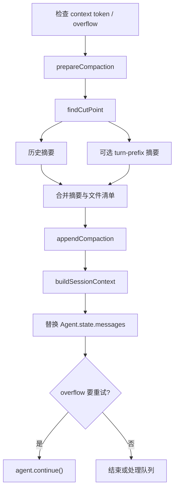
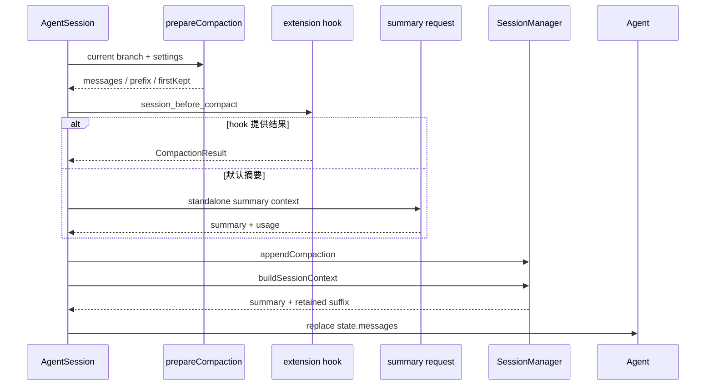

# 专题三：上下文压缩

## 1. 课题范围

本文只解释仓库实际实现的 compaction：何时触发、如何估算 token、如何选择保留边界、如何生成摘要、如何写回 session，以及 overflow 后为什么能够重试一次。



## 2. 结论一：压缩通过追加 checkpoint 改变上下文，不删除旧消息

压缩结果保存为 `CompactionEntry`，其中 summary 是旧历史的替代表示，`firstKeptEntryId` 是仍需原样保留的近期后缀起点，`tokensBefore` 记录压缩前规模。

源码示例：

```ts
export interface CompactionEntry<T = unknown> extends SessionEntryBase {
	type: "compaction";
	summary: string;
	firstKeptEntryId: string;
	tokensBefore: number;
	details?: T;
	usage?: Usage;
	fromHook?: boolean;
}
```

证据：[`CompactionEntry`](../packages/coding-agent/src/core/session-manager.ts#L69)。

保存时仍走普通树追加逻辑，新 compaction 的 parent 是当前 leaf；旧 entries 没有删除路径。

源码示例：

```ts
const entry: CompactionEntry<T> = {
	type: "compaction",
	id: generateId(this.byId),
	parentId: this.leafId,
	timestamp: new Date().toISOString(),
	summary,
	firstKeptEntryId,
	tokensBefore,
	details,
	usage,
	fromHook,
};
this._appendEntry(entry);
```

证据：[`appendCompaction()`](../packages/coding-agent/src/core/session-manager.ts#L1119)。

## 3. 结论二：触发阈值和近期保留量是两个独立设置

默认开启压缩，预留 16384 token，切点目标保留近期 20000 token。触发条件严格为 `contextTokens > contextWindow - reserveTokens`。

源码示例：

```ts
export const DEFAULT_COMPACTION_SETTINGS: CompactionSettings = {
	enabled: true,
	reserveTokens: 16384,
	keepRecentTokens: 20000,
};

export function shouldCompact(contextTokens: number, contextWindow: number, settings: CompactionSettings): boolean {
	if (!settings.enabled) return false;
	return contextTokens > contextWindow - settings.reserveTokens;
}
```

证据：[默认配置和 `shouldCompact()`](../packages/coding-agent/src/core/compaction/compaction.ts#L126)。

`reserveTokens` 同时参与摘要最大输出预算；`keepRecentTokens` 只用于 `findCutPoint()`。因此“何时压缩”和“压缩后保留多少近期原文”不是一个阈值。

源码示例：

```ts
const maxTokens = Math.min(
	Math.floor(0.8 * reserveTokens),
	model.maxTokens > 0 ? model.maxTokens : Number.POSITIVE_INFINITY,
);
```

证据：[摘要预算使用 reserveTokens](../packages/coding-agent/src/core/compaction/compaction.ts#L672)；[切点使用 keepRecentTokens](../packages/coding-agent/src/core/compaction/compaction.ts#L788)。

## 4. 结论三：token 统计优先相信最近一次有效 provider usage

有效 usage 必须来自 assistant，不能是 aborted/error，并且计算出的总 token 大于 0。

源码示例：

```ts
if (
	assistantMsg.stopReason !== "aborted" &&
	assistantMsg.stopReason !== "error" &&
	assistantMsg.usage &&
	calculateContextTokens(assistantMsg.usage) > 0
) {
	return assistantMsg.usage;
}
```

证据：[`getAssistantUsage()`](../packages/coding-agent/src/core/compaction/compaction.ts#L150)。

usage 总量优先用 provider 的 `totalTokens`；没有时才把 input、output、cacheRead、cacheWrite 相加。

源码示例：

```ts
export function calculateContextTokens(usage: Usage): number {
	return usage.totalTokens || usage.input + usage.output + usage.cacheRead + usage.cacheWrite;
}
```

证据：[`calculateContextTokens()`](../packages/coding-agent/src/core/compaction/compaction.ts#L146)。

如果找到有效 usage，之前消息不再逐条估算，只估算它之后新增加的消息；没有有效 usage 才对全体消息估算。

源码示例：

```ts
if (!usageInfo) {
	let estimated = 0;
	for (const message of messages) {
		estimated += estimateTokens(message);
	}
	return {
		tokens: estimated,
		usageTokens: 0,
		trailingTokens: estimated,
		lastUsageIndex: null,
	};
}

const usageTokens = calculateContextTokens(usageInfo.usage);
let trailingTokens = 0;
for (let i = usageInfo.index + 1; i < messages.length; i++) {
	trailingTokens += estimateTokens(messages[i]);
}
```

证据：[`estimateContextTokens()`](../packages/coding-agent/src/core/compaction/compaction.ts#L202)。

## 5. 结论四：fallback 是字符估算，不是精确 tokenizer

文本按 `ceil(chars / 4)`；assistant 还统计 thinking、tool name 和序列化参数；图片按固定 4800 字符折算。

源码示例：

```ts
const ESTIMATED_IMAGE_CHARS = 4800;

if (block.type === "text" && block.text) {
	chars += block.text.length;
} else if (block.type === "image") {
	chars += ESTIMATED_IMAGE_CHARS;
}
```

证据：[文本和图片字符估算](../packages/coding-agent/src/core/compaction/compaction.ts#L244)。

源码示例：

```ts
case "assistant": {
	const assistant = message as AssistantMessage;
	for (const block of assistant.content) {
		if (block.type === "text") {
			chars += block.text.length;
		} else if (block.type === "thinking") {
			chars += block.thinking.length;
		} else if (block.type === "toolCall") {
			chars += block.name.length + JSON.stringify(block.arguments).length;
		}
	}
	return Math.ceil(chars / 4);
}
```

证据：[`estimateTokens()`](../packages/coding-agent/src/core/compaction/compaction.ts#L266)。

## 6. 结论五：toolResult 永远不是切点

切点允许 user、assistant、bashExecution、custom、branchSummary、compactionSummary；明确拒绝 toolResult。否则保留后缀可能从工具结果开始，却缺少产生它的 assistant tool call。

源码示例：

```ts
function isCutPointMessage(message: AgentMessage): boolean {
	switch (message.role) {
		case "user":
		case "assistant":
		case "bashExecution":
		case "custom":
		case "branchSummary":
		case "compactionSummary":
			return true;
		case "toolResult":
			return false;
	}
	return false;
}
```

证据：[`isCutPointMessage()`](../packages/coding-agent/src/core/compaction/compaction.ts#L308)。

收集切点时还跳过 compaction entry，并通过 `sessionEntryToContextMessages()` 排除不进入 context 的状态节点。

源码示例：

```ts
for (let i = startIndex; i < endIndex; i++) {
	const entry = entries[i];
	if (entry.type === "compaction") {
		continue;
	}
	if (sessionEntryToContextMessages(entry).some(isCutPointMessage)) {
		cutPoints.push(i);
	}
}
```

证据：[`findValidCutPoints()`](../packages/coding-agent/src/core/compaction/compaction.ts#L351)。

## 7. 结论六：切点从最新消息向旧消息反向累计

算法从 `endIndex - 1` 向前估算。累计达到 `keepRecentTokens` 后，选择当前位置或其后的第一个合法切点，因此切点之后保留的原文规模接近目标值。

源码示例：

```ts
for (let i = endIndex - 1; i >= startIndex; i--) {
	const entry = entries[i];
	const messageTokens = sessionEntryToContextMessages(entry).reduce(
		(sum, message) => sum + estimateTokens(message),
		0,
	);
	if (messageTokens === 0) continue;
	accumulatedTokens += messageTokens;

	if (accumulatedTokens >= keepRecentTokens) {
		for (let c = 0; c < cutPoints.length; c++) {
			if (cutPoints[c] >= i) {
				cutIndex = cutPoints[c];
				break;
			}
		}
		break;
	}
}
```

证据：[`findCutPoint()`](../packages/coding-agent/src/core/compaction/compaction.ts#L403)。

选定后还会向前吸收相邻、不进入 context 的 metadata entry，直到遇到 compaction 或 context-visible entry。这样紧邻保留消息的模型/标签状态不会无意义地落到摘要侧。

源码示例：

```ts
while (cutIndex > startIndex) {
	const prevEntry = entries[cutIndex - 1];
	if (prevEntry.type === "compaction" || sessionEntryToContextMessages(prevEntry).length > 0) {
		break;
	}
	cutIndex--;
}
```

证据：[切点前 metadata 吸收](../packages/coding-agent/src/core/compaction/compaction.ts#L441)。

## 8. 结论七：切到一轮中间时，会单独摘要该轮前缀

user、bashExecution、custom、branchSummary、compactionSummary 被视为一轮的开始；assistant/toolResult 不是。切点不是 turn start 时，代码向前寻找本轮开始位置。

源码示例：

```ts
function isTurnStartMessage(message: AgentMessage): boolean {
	switch (message.role) {
		case "user":
		case "bashExecution":
		case "custom":
		case "branchSummary":
		case "compactionSummary":
			return true;
		case "assistant":
		case "toolResult":
			return false;
	}
	return false;
}
```

证据：[`isTurnStartMessage()`](../packages/coding-agent/src/core/compaction/compaction.ts#L323)。

准备结果把“本轮之前的历史”和“被截断轮次的前缀”分开。

源码示例：

```ts
const historyEnd = cutPoint.isSplitTurn ? cutPoint.turnStartIndex : cutPoint.firstKeptEntryIndex;

for (let i = boundaryStart; i < historyEnd; i++) {
	const msg = getMessageFromEntryForCompaction(pathEntries[i]);
	if (msg) messagesToSummarize.push(msg);
}

if (cutPoint.isSplitTurn) {
	for (let i = cutPoint.turnStartIndex; i < cutPoint.firstKeptEntryIndex; i++) {
		const msg = getMessageFromEntryForCompaction(pathEntries[i]);
		if (msg) turnPrefixMessages.push(msg);
	}
}
```

证据：[`prepareCompaction()` 的两段构造](../packages/coding-agent/src/core/compaction/compaction.ts#L797)。

## 9. 结论八：重复压缩会把上次摘要作为迭代边界

`prepareCompaction()` 从尾部找最新 compaction。找到后读取 previous summary，并从上次 `firstKeptEntryId` 开始考虑新一轮切点；如果该 id 已不存在，退回 compaction 后一个 entry。

源码示例：

```ts
let prevCompactionIndex = -1;
for (let i = pathEntries.length - 1; i >= 0; i--) {
	if (pathEntries[i].type === "compaction") {
		prevCompactionIndex = i;
		break;
	}
}

let previousSummary: string | undefined;
let boundaryStart = 0;
if (prevCompactionIndex >= 0) {
	const prevCompaction = pathEntries[prevCompactionIndex] as CompactionEntry;
	previousSummary = prevCompaction.summary;
	const firstKeptEntryIndex = pathEntries.findIndex((entry) => entry.id === prevCompaction.firstKeptEntryId);
	boundaryStart = firstKeptEntryIndex >= 0 ? firstKeptEntryIndex : prevCompactionIndex + 1;
}
```

证据：[`prepareCompaction()` 的上次边界处理](../packages/coding-agent/src/core/compaction/compaction.ts#L768)。

如果当前路径最后一个节点已经是 compaction，函数直接返回 undefined，避免没有新消息时连续压缩。

源码示例：

```ts
if (pathEntries.length > 0 && pathEntries[pathEntries.length - 1].type === "compaction") {
	return undefined;
}
```

证据：[`prepareCompaction()` 的首个退出条件](../packages/coding-agent/src/core/compaction/compaction.ts#L760)。

## 10. 结论九：摘要是一个独立模型请求，不是继续原对话

待摘要的 AgentMessage 先转成标准 LLM messages，再序列化为带角色标签的文本，包在 `<conversation>` 中。previous summary 另放在 `<previous-summary>` 中。

源码示例：

```ts
const llmMessages = convertToLlm(currentMessages);
const conversationText = serializeConversation(llmMessages);

let promptText = `<conversation>\n${conversationText}\n</conversation>\n\n`;
if (previousSummary) {
	promptText += `<previous-summary>\n${previousSummary}\n</previous-summary>\n\n`;
}
promptText += basePrompt;
```

证据：[`generateSummaryWithUsage()`](../packages/coding-agent/src/core/compaction/compaction.ts#L656)。

最终 summary context 只包含固定 system prompt 和一条新的 user message。

源码示例：

```ts
function buildSummarizationContext(promptText: string): Context {
	return {
		systemPrompt: SUMMARIZATION_SYSTEM_PROMPT,
		messages: [
			{
				role: "user",
				content: [{ type: "text", text: promptText }],
				timestamp: Date.now(),
			},
		],
	};
}
```

证据：[`buildSummarizationContext()`](../packages/coding-agent/src/core/compaction/compaction.ts#L642)。

## 11. 结论十：摘要结果必须完整，且不能产生 tool call

summary response 以 error 结束会报错；以 length 结束也报错，因为截断摘要不能成为 checkpoint。响应中出现任何 toolCall 同样拒绝。

源码示例：

```ts
export function getSummarizationFailure(response: AssistantMessage, label: string): string | undefined {
	if (response.stopReason === "error") {
		return `${label} failed: ${response.errorMessage || "Unknown error"}`;
	}
	if (response.stopReason === "length") {
		return `${label} failed: generation hit the token cap and the summary is incomplete`;
	}
	return undefined;
}
```

证据：[`getSummarizationFailure()`](../packages/coding-agent/src/core/compaction/compaction.ts#L545)。

源码示例：

```ts
const failure = getSummarizationFailure(response, "Summarization");
if (failure) {
	throw new Error(failure);
}
if (response.content.some((block) => block.type === "toolCall")) {
	throw new Error("Summarization attempted to call a tool");
}
```

证据：[摘要响应校验](../packages/coding-agent/src/core/compaction/compaction.ts#L715)。

## 12. 结论十一：split turn 会生成两份摘要再合并

普通情况只生成 history summary。split turn 时，先根据需要生成旧历史摘要，再用较小预算生成 turn-prefix summary，最后用固定分隔文本合并 usage 和内容。

源码示例：

```ts
if (isSplitTurn && turnPrefixMessages.length > 0) {
	let historyText = "No prior history.";
	let historyUsage: Usage | undefined;
	if (messagesToSummarize.length > 0) {
		const historyResult = await generateSummaryWithUsage(/* ... */);
		historyText = historyResult.text;
		historyUsage = historyResult.usage;
	}
	const turnPrefixResult = await generateTurnPrefixSummary(/* ... */);
	summary = `${historyText}\n\n---\n\n**Turn Context (split turn):**\n\n${turnPrefixResult.text}`;
	summaryUsage = historyUsage ? combineUsage(historyUsage, turnPrefixResult.usage) : turnPrefixResult.usage;
} else {
	const result = await generateSummaryWithUsage(/* ... */);
	summary = result.text;
	summaryUsage = result.usage;
}
```

证据：[`compact()` 的 split/non-split 分支](../packages/coding-agent/src/core/compaction/compaction.ts#L868)。

turn-prefix 最大输出使用 `0.5 * reserveTokens`，普通 history 使用 `0.8 * reserveTokens`。

源码示例：

```ts
const maxTokens = Math.min(
	Math.floor(0.5 * reserveTokens),
	model.maxTokens > 0 ? model.maxTokens : Number.POSITIVE_INFINITY,
);
```

证据：[`generateTurnPrefixSummary()`](../packages/coding-agent/src/core/compaction/compaction.ts#L979)。

## 13. 结论十二：工具大输出会截断，但文件操作另行保存

摘要输入中的 tool result 最多保留 2000 字符，避免大型输出占满摘要请求。

源码示例：

```ts
const TOOL_RESULT_MAX_CHARS = 2000;

// ...
parts.push(`[Tool result]: ${truncateForSummary(content, TOOL_RESULT_MAX_CHARS)}`);
```

证据：[tool result 截断](../packages/coding-agent/src/core/compaction/utils.ts#L89)。

同时，prepare 阶段从被摘要消息和 turn prefix 中提取文件操作；compact 完成时计算 read/modified 清单并附加到 summary，details 也保存该清单。

源码示例：

```ts
const fileOps = extractFileOperations(messagesToSummarize, pathEntries, prevCompactionIndex);

if (cutPoint.isSplitTurn) {
	for (const msg of turnPrefixMessages) {
		extractFileOpsFromMessage(msg, fileOps);
	}
}
```

证据：[prepare 阶段的文件操作提取](../packages/coding-agent/src/core/compaction/compaction.ts#L819)。

源码示例：

```ts
const { readFiles, modifiedFiles } = computeFileLists(fileOps);
summary += formatFileOperations(readFiles, modifiedFiles);

return {
	summary,
	firstKeptEntryId,
	tokensBefore,
	usage: summaryUsage,
	details: { readFiles, modifiedFiles } as CompactionDetails,
};
```

证据：[`compact()` 的最终结果](../packages/coding-agent/src/core/compaction/compaction.ts#L959)。

## 14. 结论十三：扩展可以取消压缩或完全替换压缩结果

手动和自动路径都发 `session_before_compact`。hook 可以返回 `cancel`，也可以提供包含 summary、firstKeptEntryId、tokensBefore 等字段的完整 compaction。

源码示例：

```ts
const extensionResult = (await this._extensionRunner.emit({
	type: "session_before_compact",
	preparation,
	branchEntries: pathEntries,
	customInstructions: undefined,
	reason,
	willRetry,
	signal: this._autoCompactionAbortController.signal,
})) as SessionBeforeCompactResult | undefined;

if (extensionResult?.cancel) {
	// ...emit end/failure...
	return false;
}

if (extensionResult?.compaction) {
	extensionCompaction = extensionResult.compaction;
	fromExtension = true;
}
```

证据：[自动压缩 hook](../packages/coding-agent/src/core/agent-session.ts#L2271)；[手动压缩 hook](../packages/coding-agent/src/core/agent-session.ts#L1972)。

## 15. 结论十四：自动压缩有三条实际路径

第一条是失败后的 overflow recovery；第二条是成功响应已经越过窗口，只压缩不重试；第三条是普通阈值压缩。

源码示例：

```ts
const contextOverflow = sameModel && isContextOverflow(assistantMessage, contextWindow);
const recoverableLength = sameModel && isRecoverableLength(assistantMessage, this.model?.maxTokens ?? 0);
if (contextOverflow || recoverableLength) {
	const willRetry = assistantMessage.stopReason !== "stop";

	if (!willRetry) {
		return await this._runAutoCompaction("overflow", false);
	}

	// ...overflow recovery...
	return await this._runAutoCompaction("overflow", willRetry);
}

if (shouldCompact(contextTokens, contextWindow, settings)) {
	return await this._runAutoCompaction("threshold", false);
}
```

证据：[`_checkCompaction()`](../packages/coding-agent/src/core/agent-session.ts#L2132)。

检查还要求 assistant 来自当前模型，并跳过最新 compaction 之前的旧 assistant，避免模型切换或旧 usage 误触发。

源码示例：

```ts
const sameModel =
	this.model && assistantMessage.provider === this.model.provider && assistantMessage.model === this.model.id;

const compactionEntry = getLatestCompactionEntry(this.sessionManager.getBranch());
const assistantIsFromBeforeCompaction =
	compactionEntry !== null && assistantMessage.timestamp <= new Date(compactionEntry.timestamp).getTime();
if (assistantIsFromBeforeCompaction) {
	return false;
}
```

证据：[模型和时间边界检查](../packages/coding-agent/src/core/agent-session.ts#L2141)。

## 16. 结论十五：overflow 最多进行一次 compact-and-retry

`_overflowRecoveryAttempted` 防止同一输入无限压缩重试。第一次恢复时，失败或截断 assistant 从 Agent state 末尾移除，但仍留在 session 历史。

源码示例：

```ts
if (this._overflowRecoveryAttempted) {
	// ...emit recovery failed...
	return false;
}

this._overflowRecoveryAttempted = true;
const messages = this.agent.state.messages;
if (messages.length > 0 && messages[messages.length - 1].role === "assistant") {
	this.agent.state.messages = messages.slice(0, -1);
}
return await this._runAutoCompaction("overflow", willRetry);
```

证据：[一次性恢复保护和首次移除](../packages/coding-agent/src/core/agent-session.ts#L2172)。

压缩后重建 messages 可能又把该失败 assistant 作为保留后缀带回来，因此 `_runAutoCompaction()` 在返回 true 前再次移除它。随后 `AgentSession._runAgentPrompt()` 的 post-run 循环调用 `agent.continue()`。

源码示例：

```ts
if (willRetry) {
	const messages = this.agent.state.messages;
	const lastMsg = messages[messages.length - 1];
	if (lastMsg?.role === "assistant" && (lastMsg.stopReason === "error" || lastMsg.stopReason === "length")) {
		this.agent.state.messages = messages.slice(0, -1);
	}
	return true;
}
```

证据：[重建后的第二次移除](../packages/coding-agent/src/core/agent-session.ts#L2387)。

源码示例：

```ts
await this.agent.prompt(messages);
while (await this._handlePostAgentRun()) {
	await this.agent.continue();
}
```

证据：[`_runAgentPrompt()` 的继续循环](../packages/coding-agent/src/core/agent-session.ts#L1105)。

## 17. 结论十六：压缩成功后重新从 session 构造 Agent messages

自动路径和手动路径都先追加 compaction，再调用 `buildSessionContext()` 并整体替换 Agent messages。这样 summary、保留后缀和新消息都经过同一 session 投影规则。

源码示例：

```ts
this.sessionManager.appendCompaction(summary, firstKeptEntryId, tokensBefore, details, fromExtension, usage);
const sessionContext = this.sessionManager.buildSessionContext();
this.agent.state.messages = sessionContext.messages;
const estimatedTokensAfter = estimateMessagesTokens(sessionContext.messages);
```

证据：[自动压缩写回](../packages/coding-agent/src/core/agent-session.ts#L2356)；[手动压缩写回](../packages/coding-agent/src/core/agent-session.ts#L2031)。



## 18. 本专题应记住的不变量

1. 压缩只追加 checkpoint，不删除 session 旧节点。证据：[`appendCompaction()`](../packages/coding-agent/src/core/session-manager.ts#L1119)。
2. toolResult 不能作为 first kept cut point。证据：[`isCutPointMessage()`](../packages/coding-agent/src/core/compaction/compaction.ts#L308)。
3. 最近 provider usage 与其后的估算消息共同构成当前 token 估计。证据：[`estimateContextTokens()`](../packages/coding-agent/src/core/compaction/compaction.ts#L202)。
4. split turn 的历史和轮次前缀分别摘要后再合并。证据：[`compact()`](../packages/coding-agent/src/core/compaction/compaction.ts#L868)。
5. 不完整或试图调用工具的 summary 不会写入 session。证据：[`getSummarizationFailure()`](../packages/coding-agent/src/core/compaction/compaction.ts#L545) 和 [结果验证](../packages/coding-agent/src/core/compaction/compaction.ts#L715)。
6. overflow compact-and-retry 最多一次。证据：[`_checkCompaction()`](../packages/coding-agent/src/core/agent-session.ts#L2172)。

返回：[专题索引](./CORE_TOPICS_INDEX.zh-CN.md)。
