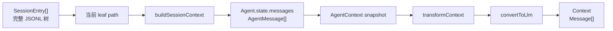
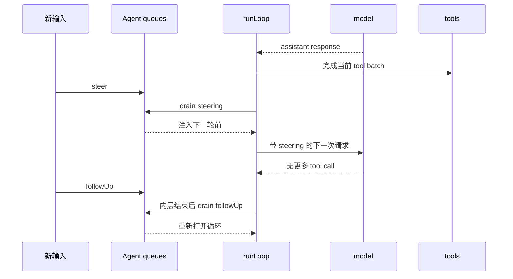

# 专题二：上下文管理

## 1. 课题范围

本文所说的“上下文”严格按源码区分为四层：完整会话树、压缩感知的 Agent transcript、单次 run 的 `AgentContext` 快照、发送给 provider 的 `Context`。它们之间通过显式转换连接，不是同一个数组的别名。



## 2. 结论一：`AgentState` 是跨轮可变状态，`AgentContext` 是一次循环快照

`AgentState` 保存 system prompt、model、thinking、活动 tools、messages、流式消息、正在执行的工具 id 和错误。`AgentContext` 只包含一次模型循环需要的 system prompt、messages 和 tools。

源码示例：

```ts
export interface AgentState {
	systemPrompt: string;
	model: Model<any>;
	thinkingLevel: ThinkingLevel;
	set tools(tools: AgentTool<any>[]);
	get tools(): AgentTool<any>[];
	set messages(messages: AgentMessage[]);
	get messages(): AgentMessage[];
	readonly isStreaming: boolean;
	readonly streamingMessage?: AgentMessage;
	readonly pendingToolCalls: ReadonlySet<string>;
	readonly errorMessage?: string;
}

export interface AgentContext {
	systemPrompt: string;
	messages: AgentMessage[];
	tools?: AgentTool<any>[];
}
```

证据：[`AgentState` 与 `AgentContext`](../packages/agent/src/types.ts#L334)。

## 3. 结论二：赋给 Agent 的 messages/tools 会复制顶层数组

`createMutableAgentState()` 把初始数组复制；属性 setter 也执行 `slice()`。这阻止调用者随后 push 原数组时无意改变 Agent 的数组结构，但不会深拷贝数组中的 message/tool 对象。

源码示例：

```ts
let tools = initialState?.tools?.slice() ?? [];
let messages = initialState?.messages?.slice() ?? [];

return {
	// ...
	set tools(nextTools: AgentTool<any>[]) {
		tools = nextTools.slice();
	},
	get messages() {
		return messages;
	},
	set messages(nextMessages: AgentMessage[]) {
		messages = nextMessages.slice();
	},
};
```

证据：[`createMutableAgentState()`](../packages/agent/src/agent.ts#L68)。

## 4. 结论三：进入 agent-loop 前再次建立上下文快照

`Agent.runPromptMessages()` 不把 `_state` 直接交给低层循环，而是调用 `createContextSnapshot()`。其中 messages 和 tools 再次浅复制。

源码示例：

```ts
await runAgentLoop(
	messages,
	this.createContextSnapshot(),
	this.createLoopConfig(options),
	(event) => this.processEvents(event),
	signal,
	this.streamFunction,
);
```

证据：[`runPromptMessages()`](../packages/agent/src/agent.ts#L409)。

源码示例：

```ts
private createContextSnapshot(): AgentContext {
	return {
		systemPrompt: this._state.systemPrompt,
		messages: this._state.messages.slice(),
		tools: this._state.tools.slice(),
	};
}
```

证据：[`createContextSnapshot()`](../packages/agent/src/agent.ts#L437)。

## 5. 结论四：新 prompt 同时进入运行上下文和本次新增消息集合

`runAgentLoop()` 复制 prompts 到 `newMessages`，并把 prompts 拼到 context 的旧 messages 后。`newMessages` 用于最终 `agent_end` 返回本次 run 新增内容；`currentContext.messages` 用于下一次模型请求。

源码示例：

```ts
const newMessages: AgentMessage[] = [...prompts];
const currentContext: AgentContext = {
	...context,
	messages: [...context.messages, ...prompts],
};

await emit({ type: "agent_start" });
await emit({ type: "turn_start" });
for (const prompt of prompts) {
	await emit({ type: "message_start", message: prompt });
	await emit({ type: "message_end", message: prompt });
}
```

证据：[`runAgentLoop()`](../packages/agent/src/agent-loop.ts#L96)。

## 6. 结论五：最终 transcript 由事件归约，而不是低层数组回传直接替换

低层 loop 通过 `emit` 发事件；`Agent.processEvents()` 在 `message_end` 时把最终消息追加到 `_state.messages`。因此 user、assistant、toolResult 都经过同一个事件入口进入跨轮状态。

源码示例：

```ts
case "message_start":
	this._state.streamingMessage = event.message;
	break;

case "message_update":
	this._state.streamingMessage = event.message;
	break;

case "message_end":
	this._state.streamingMessage = undefined;
	this._state.messages.push(event.message);
	break;
```

证据：[`Agent.processEvents()`](../packages/agent/src/agent.ts#L544)。

`processEvents()` 更新内部状态后，会顺序等待所有 subscriber。`AgentSession` 正是 subscriber 之一，所以同一最终消息随后被持久化。

源码示例：

```ts
for (const listener of this.listeners) {
	await listener(event, signal);
}
```

证据：[事件 listener 的 await 顺序](../packages/agent/src/agent.ts#L584)；[AgentSession 安装订阅](../packages/coding-agent/src/core/agent-session.ts#L400)。

## 7. 结论六：partial assistant 在当前上下文中只占一个位置

provider 的 start 事件第一次 push partial；text、thinking、tool-call delta 都替换最后一项；done/error 再替换成 final message。这避免每个增量都进入 transcript。

源码示例：

```ts
case "start":
	partialMessage = event.partial;
	context.messages.push(partialMessage);
	addedPartial = true;
	await emit({ type: "message_start", message: { ...partialMessage } });
	break;

case "text_delta":
case "thinking_delta":
case "toolcall_delta":
	if (partialMessage) {
		partialMessage = event.partial;
		context.messages[context.messages.length - 1] = partialMessage;
		await emit({ type: "message_update", /* ... */ });
	}
	break;
```

证据：[`streamAssistantResponse()` 的流式归并](../packages/agent/src/agent-loop.ts#L325)。

最终消息替换同一位置，并只发一次 `message_end`。

源码示例：

```ts
const finalMessage = await response.result();
if (addedPartial) {
	context.messages[context.messages.length - 1] = finalMessage;
} else {
	context.messages.push(finalMessage);
}
await emit({ type: "message_end", message: finalMessage });
return finalMessage;
```

证据：[final message 落位](../packages/agent/src/agent-loop.ts#L354)。

## 8. 结论七：模型调用前有两级上下文转换

第一级 `transformContext` 仍处理 `AgentMessage[]`，扩展可以改变模型将看到的应用消息。第二级 `convertToLlm` 把自定义角色转换为 provider 接受的 `Message[]`。之后才构造模型 `Context`。

源码示例：

```ts
let messages = context.messages;
if (config.transformContext) {
	messages = await config.transformContext(messages, signal);
}

const llmMessages = await config.convertToLlm(messages);

const llmContext: Context = {
	systemPrompt: context.systemPrompt,
	messages: llmMessages,
	tools: context.tools,
};
```

证据：[`streamAssistantResponse()` 的请求边界](../packages/agent/src/agent-loop.ts#L296)。

SDK 把 `transformContext` 连接到 extension runner 的 context event。

源码示例：

```ts
transformContext: async (messages) => {
	const runner = extensionRunnerRef.current;
	if (!runner) return messages;
	return runner.emitContext(messages);
},
```

证据：[`createAgentSession()` 注入 context hook](../packages/coding-agent/src/core/sdk.ts#L362)。

## 9. 结论八：自定义消息在 provider 边界统一变成标准消息

`bashExecution` 变成 user message；`custom` 变成 user；branch/compaction summary 加固定前后缀后变成 user；标准 user/assistant/toolResult 原样保留。

源码示例：

```ts
case "custom": {
	const content = typeof m.content === "string" ? [{ type: "text" as const, text: m.content }] : m.content;
	return {
		role: "user",
		content,
		timestamp: m.timestamp,
	};
}
case "compactionSummary":
	return {
		role: "user",
		content: [
			{ type: "text" as const, text: COMPACTION_SUMMARY_PREFIX + m.summary + COMPACTION_SUMMARY_SUFFIX },
		],
		timestamp: m.timestamp,
	};
case "user":
case "assistant":
case "toolResult":
	return m;
```

证据：[`convertToLlm()`](../packages/coding-agent/src/core/messages.ts#L148)。

`bashExecution.excludeFromContext` 为 true 时直接返回 `undefined`，最后由 filter 移除。它可以保存在应用会话中，但不发送给 provider。

源码示例：

```ts
case "bashExecution":
	if (m.excludeFromContext) {
		return undefined;
	}
	return {
		role: "user",
		content: [{ type: "text", text: bashExecutionToText(m) }],
		timestamp: m.timestamp,
	};
```

证据：[bashExecution 的上下文过滤](../packages/coding-agent/src/core/messages.ts#L151)。

## 10. 结论九：toolResult 必须先进入 context，模型才会进入下一轮

assistant 中含 tool call 时，loop 执行工具，并把每条 tool result 同时 push 到 `currentContext.messages` 和 `newMessages`。下一轮 `streamAssistantResponse()` 使用更新后的 context。

源码示例：

```ts
if (toolCalls.length > 0) {
	const executedToolBatch =
		message.stopReason === "length"
			? await failToolCallsFromTruncatedMessage(toolCalls, emit)
			: await executeToolCalls(currentContext, message, config, signal, emit);
	toolResults.push(...executedToolBatch.messages);
	hasMoreToolCalls = !executedToolBatch.terminate;

	for (const result of toolResults) {
		currentContext.messages.push(result);
		newMessages.push(result);
	}
}
```

证据：[`runLoop()` 的工具结果回灌](../packages/agent/src/agent-loop.ts#L227)。

## 11. 结论十：steering 与 follow-up 修改上下文的时机不同

两个队列都是 FIFO，但 drain mode 可为 `all` 或 `one-at-a-time`。`all` 复制全部并清空；单条模式只移除第一项。

源码示例：

```ts
drain(): AgentMessage[] {
	if (this.mode === "all") {
		const drained = this.messages.slice();
		this.messages = [];
		return drained;
	}

	const first = this.messages[0];
	if (!first) {
		return [];
	}
	this.messages = this.messages.slice(1);
	return [first];
}
```

证据：[`PendingMessageQueue.drain()`](../packages/agent/src/agent.ts#L141)。

steering 在每个 assistant + tool batch 完成后读取，作为 pending message 在下一次模型请求前注入。follow-up 只在内层循环原本要停止时读取。

源码示例：

```ts
pendingMessages = (await config.getSteeringMessages?.()) || [];
// inner loop ends

const followUpMessages = (await config.getFollowUpMessages?.()) || [];
if (followUpMessages.length > 0) {
	pendingMessages = followUpMessages;
	continue;
}
```

证据：[`runLoop()` 的两个队列读取点](../packages/agent/src/agent-loop.ts#L263)。



## 12. 结论十一：同一个 run 的下一轮可以刷新整份上下文配置

`runLoop()` 在已有 `lastCompletedTurn` 时调用 `prepareNextTurn`。返回值可以替换 context、model 和 reasoning，再开始下一轮。这是工具切换、模型切换和压缩在同一个 run 内生效的入口。

源码示例：

```ts
if (lastCompletedTurn) {
	const nextTurnSnapshot = await config.prepareNextTurn?.(lastCompletedTurn);
	if (nextTurnSnapshot) {
		currentContext = nextTurnSnapshot.context ?? currentContext;
		config = {
			...config,
			model: nextTurnSnapshot.model ?? config.model,
			reasoning:
				nextTurnSnapshot.thinkingLevel === undefined
					? config.reasoning
					: nextTurnSnapshot.thinkingLevel === "off"
						? undefined
						: nextTurnSnapshot.thinkingLevel,
		};
	}
}
```

证据：[`runLoop()` 的下一轮刷新](../packages/agent/src/agent-loop.ts#L182)。

`AgentSession` 安装的实现先做发送前压缩，然后从当前状态重新读取 system prompt、tools、model 和 thinking。

源码示例：

```ts
this.agent.prepareNextTurnWithContext = async (turn, signal) => {
	const context = await this._compactBeforeNextAssistantResponse(turn.context);
	const previousSnapshot = await previousPrepareNextTurnWithContext?.({ ...turn, context }, signal);
	const nextContext = previousSnapshot?.context ?? context;

	return {
		...previousSnapshot,
		context: {
			...nextContext,
			systemPrompt: this._systemPromptOverride ?? this._baseSystemPrompt,
			tools: this.agent.state.tools.slice(),
		},
		model: this.agent.state.model,
		thinkingLevel: this.agent.state.thinkingLevel,
	};
};
```

证据：[`_installAgentNextTurnRefresh()`](../packages/coding-agent/src/core/agent-session.ts#L561)。

## 13. 结论十二：压缩替换 Agent transcript，但保留 SessionManager 历史

压缩成功后，`AgentSession` 追加 compaction entry，再调用 `buildSessionContext()`，最后整体替换 `agent.state.messages`。这一步改变未来模型看到的 transcript，不删除 session entries。

源码示例：

```ts
this.sessionManager.appendCompaction(summary, firstKeptEntryId, tokensBefore, details, fromExtension, usage);
const sessionContext = this.sessionManager.buildSessionContext();
this.agent.state.messages = sessionContext.messages;
```

证据：[自动压缩后的上下文替换](../packages/coding-agent/src/core/agent-session.ts#L2356)。

## 14. 结论十三：运行结束和真正 idle 不是同一个时间点

`agent_end` 是低层 loop 最后一个事件，但 subscriber 仍需 await。`finishRun()` 在 executor 和事件 listener 都完成后的 finally 中清理 `isStreaming`、partial 和 pending tool ids，才解除 active run。

源码示例：

```ts
try {
	await executor(abortController.signal);
} catch (error) {
	await this.handleRunFailure(error, abortController.signal.aborted);
} finally {
	this.finishRun();
}
```

证据：[`runWithLifecycle()`](../packages/agent/src/agent.ts#L486)。

源码示例：

```ts
private finishRun(): void {
	this._state.isStreaming = false;
	this._state.streamingMessage = undefined;
	this._state.pendingToolCalls = new Set<string>();
	this.activeRun?.resolve();
	this.activeRun = undefined;
}
```

证据：[`finishRun()`](../packages/agent/src/agent.ts#L529)。

## 15. 本专题应记住的不变量

1. Session entries、Agent messages、AgentContext 和 provider messages 是四种表示。证据：[`buildSessionContext()`](../packages/coding-agent/src/core/session-manager.ts#L469)、[`createContextSnapshot()`](../packages/agent/src/agent.ts#L437)、[`convertToLlm()`](../packages/coding-agent/src/core/messages.ts#L148)。
2. partial 只用于流式状态，final `message_end` 才进入跨轮 transcript。证据：[`streamAssistantResponse()`](../packages/agent/src/agent-loop.ts#L325) 和 [`processEvents()`](../packages/agent/src/agent.ts#L544)。
3. toolResult 在下一次模型请求前必须追加到 context。证据：[`runLoop()`](../packages/agent/src/agent-loop.ts#L227)。
4. steering 在当前 turn 后注入，follow-up 在 agent 原本停止时注入。证据：[`runLoop()`](../packages/agent/src/agent-loop.ts#L263)。
5. 同一 run 的下一轮通过 `prepareNextTurnWithContext` 显式刷新，不依赖隐式共享数组。证据：[`_installAgentNextTurnRefresh()`](../packages/coding-agent/src/core/agent-session.ts#L561)。

返回：[专题索引](./CORE_TOPICS_INDEX.zh-CN.md)。
