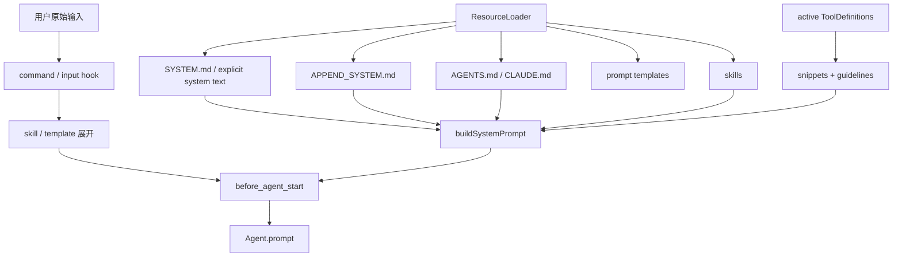
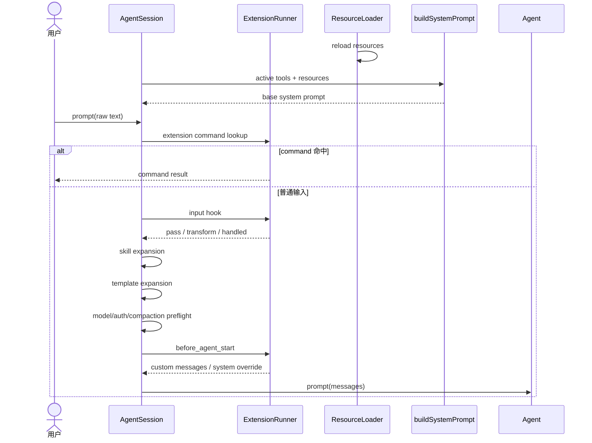

# 专题四：Prompt 管理

## 1. 课题范围

源码中的 prompt 不是单一字符串。本文区分 system prompt、项目上下文文件、append prompt、skill、文件模板、用户消息、扩展命令、`input` hook、`before_agent_start` override 和上下文压缩使用的独立摘要 prompt。



## 2. 结论一：四类 prompt 的生命周期不同

`BuildSystemPromptOptions` 明确列出 custom base、活动工具、tool snippets、guidelines、append text、cwd、context files 和 skills。它们共同构成 system prompt，但 user prompt 不在这个类型里。

源码示例：

```ts
export interface BuildSystemPromptOptions {
	customPrompt?: string;
	selectedTools?: string[];
	toolSnippets?: Record<string, string>;
	promptGuidelines?: string[];
	appendSystemPrompt?: string;
	cwd: string;
	contextFiles?: Array<{ path: string; content: string }>;
	skills?: Skill[];
}
```

证据：[`BuildSystemPromptOptions`](../packages/coding-agent/src/core/system-prompt.ts#L8)。

用户输入最终被构造为 role=user 的 message，放入 `messages`，与 system prompt 分开发送。

源码示例：

```ts
const userContent: (TextContent | ImageContent)[] = [{ type: "text", text: expandedText }];
if (currentImages) {
	userContent.push(...currentImages);
}
messages.push({
	role: "user",
	content: userContent,
	timestamp: Date.now(),
});
```

证据：[`AgentSession.prompt()` 构造用户消息](../packages/coding-agent/src/core/agent-session.ts#L1256)。

摘要 prompt 又是独立 context：固定 summary system prompt + 一条包含序列化对话的 user message，不进入普通 system prompt 构造过程。

源码示例：

```ts
return {
	systemPrompt: SUMMARIZATION_SYSTEM_PROMPT,
	messages: [
		{
			role: "user",
			content: [{ type: "text", text: promptText }],
			timestamp: Date.now(),
		},
	],
};
```

证据：[`buildSummarizationContext()`](../packages/coding-agent/src/core/compaction/compaction.ts#L642)。

## 3. 结论二：系统 prompt 显式输入既可以是文件，也可以是原始文本

`resolvePromptInput()` 先检查输入是否指向存在的文件；是文件就读取并去 BOM，读取失败时打印 warning 并退回原字符串；不是文件则直接把输入视为 prompt 文本。

源码示例：

```ts
function resolvePromptInput(input: string | undefined, description: string): string | undefined {
	if (!input) {
		return undefined;
	}

	if (existsSync(input)) {
		try {
			return stripBom(readFileSync(input, "utf-8"));
		} catch (error) {
			console.error(chalk.yellow(`Warning: Could not read ${description} file ${input}: ${error}`));
			return input;
		}
	}

	return input;
}
```

证据：[`resolvePromptInput()`](../packages/coding-agent/src/core/resource-loader.ts#L54)。

## 4. 结论三：自动发现 system prompt 受项目信任状态控制

受信任项目若存在 `.pi/SYSTEM.md`，优先使用项目文件；否则退回 agentDir 的全局 `SYSTEM.md`。不受信任时即使项目文件存在也不会使用。

源码示例：

```ts
private discoverSystemPromptFile(): string | undefined {
	const projectPath = join(this.cwd, CONFIG_DIR_NAME, "SYSTEM.md");
	if (this.settingsManager.isProjectTrusted() && existsSync(projectPath)) {
		return projectPath;
	}

	const globalPath = join(this.agentDir, "SYSTEM.md");
	if (existsSync(globalPath)) {
		return globalPath;
	}

	return undefined;
}
```

证据：[`discoverSystemPromptFile()`](../packages/coding-agent/src/core/resource-loader.ts#L1023)。

append prompt 使用同一信任与优先级结构，只是文件名为 `APPEND_SYSTEM.md`。

源码示例：

```ts
private discoverAppendSystemPromptFile(): string | undefined {
	const projectPath = join(this.cwd, CONFIG_DIR_NAME, "APPEND_SYSTEM.md");
	if (this.settingsManager.isProjectTrusted() && existsSync(projectPath)) {
		return projectPath;
	}

	const globalPath = join(this.agentDir, "APPEND_SYSTEM.md");
	if (existsSync(globalPath)) {
		return globalPath;
	}

	return undefined;
}
```

证据：[`discoverAppendSystemPromptFile()`](../packages/coding-agent/src/core/resource-loader.ts#L1037)。

## 5. 结论四：同一目录只加载一个项目上下文文件

候选顺序是 `AGENTS.override.md`、`AGENTS.md`、大小写变体、`CLAUDE.md`。循环遇到第一个有效文件就 return，所以 `AGENTS.override.md` 不是与 `AGENTS.md` 合并，而是在同一目录中遮蔽后者。

源码示例：

```ts
const candidates = ["AGENTS.override.md", "AGENTS.md", "AGENTS.MD", "CLAUDE.md", "CLAUDE.MD"];
for (const filename of candidates) {
	const filePath = join(dir, filename);
	if (existsSync(filePath)) {
		try {
			if (!statSync(filePath).isFile()) {
				continue;
			}
			return {
				path: filePath,
				content: stripBom(readFileSync(filePath, "utf-8")),
			};
		} catch (error) {
			// warning
		}
	}
}
return null;
```

证据：[`loadContextFileFromDir()`](../packages/coding-agent/src/core/resource-loader.ts#L71)。

## 6. 结论五：跨目录上下文按“全局 → 根目录 → cwd”排列

先加载 agentDir 的全局 context。随后从 cwd 向根遍历，但用 `unshift` 插入结果，因此祖先文件最终由宽到窄排列；最后一次性追加到全局文件之后。

源码示例：

```ts
const globalContext = loadContextFileFromDir(resolvedAgentDir);
if (globalContext) {
	contextFiles.push(globalContext);
	seenPaths.add(globalContext.path);
}

const ancestorContextFiles: Array<{ path: string; content: string }> = [];
let currentDir = resolvedCwd;

while (true) {
	const contextFile = loadContextFileFromDir(currentDir);
	if (contextFile && !isShadowed && !seenPaths.has(contextFile.path)) {
		ancestorContextFiles.unshift(contextFile);
		seenPaths.add(contextFile.path);
	}
	const parentDir = dirname(currentDir);
	if (parentDir === currentDir) break;
	currentDir = parentDir;
}

contextFiles.push(...ancestorContextFiles);
```

证据：[`loadProjectContextFiles()`](../packages/coding-agent/src/core/resource-loader.ts#L119)。

## 7. 结论六：ResourceLoader.reload 在一次刷新中统一解析资源

reload 先处理 project trust 和 settings，再让 package manager 解析资源；随后分别计算启用的 extensions、skills、prompts、themes，加载项目 context，最后解析 system/append prompt。

源码示例：

```ts
await this.settingsManager.reload();
const resolvedPaths = await this.packageManager.resolve();

const enabledExtensions = getEnabledPaths(resolvedPaths.extensions);
const enabledSkillResources = getEnabledResources(resolvedPaths.skills);
const enabledPrompts = getEnabledPaths(resolvedPaths.prompts);
const enabledThemes = getEnabledPaths(resolvedPaths.themes);
```

证据：[`DefaultResourceLoader.reload()`](../packages/coding-agent/src/core/resource-loader.ts#L388)。

项目指令和 system/append prompt 在 reload 尾部写入 loader 的缓存字段。

源码示例：

```ts
const agentsFiles = {
	agentsFiles: this.noContextFiles
		? []
		: loadProjectContextFiles({
				cwd: this.cwd,
				agentDir: this.agentDir,
			}),
};
this.agentsFiles = resolvedAgentsFiles.agentsFiles;

const systemPromptSource = this.systemPromptSource ?? this.discoverSystemPromptFile();
const baseSystemPrompt = resolvePromptInput(systemPromptSource, "system prompt");
this.systemPrompt = this.systemPromptOverride ? this.systemPromptOverride(baseSystemPrompt) : baseSystemPrompt;
```

证据：[reload 的 context/system prompt 阶段](../packages/coding-agent/src/core/resource-loader.ts#L515)。

## 8. 结论七：custom system prompt 只替换内置基础文本

有 custom prompt 时，`buildSystemPrompt()` 从该字符串开始，但仍依次追加 append text、project context、skills 和 cwd。

源码示例：

```ts
if (customPrompt) {
	let prompt = customPrompt;

	if (appendSection) {
		prompt += appendSection;
	}

	if (contextFiles.length > 0) {
		prompt += "\n\n<project_context>\n\n";
		prompt += "Project-specific instructions and guidelines:\n\n";
		for (const { path: filePath, content } of contextFiles) {
			prompt += `<project_instructions path="${filePath}">\n${content}\n</project_instructions>\n\n`;
		}
		prompt += "</project_context>\n";
	}

	if (skillFileReadTool && skills.length > 0) {
		prompt += formatSkillsForPrompt(skills, skillFileReadTool);
	}

	prompt += `\nCurrent working directory: ${promptCwd}\n`;
	return prompt;
}
```

证据：[`buildSystemPrompt()` 的 custom 分支](../packages/coding-agent/src/core/system-prompt.ts#L55)。

因此 custom prompt 分支仍会执行项目指令、skills 和 cwd 的追加逻辑；具体内容是否为空由调用方传入的资源数组决定。[证据：custom 分支仍追加资源](../packages/coding-agent/src/core/system-prompt.ts#L55)。

## 9. 结论八：默认 system prompt 只展示有 snippet 的活动工具

`selectedTools` 决定活动名称，但工具只有在 `toolSnippets` 中存在内容时才进入 Available tools 列表。没有可展示项时写 `(none)`。

源码示例：

```ts
const visibleTools = tools.filter((name) => !!toolSnippets?.[name]);
const toolsList =
	visibleTools.length > 0 ? visibleTools.map((name) => `- ${name}: ${toolSnippets![name]}`).join("\n") : "(none)";
```

证据：[`buildSystemPrompt()` 的工具列表](../packages/coding-agent/src/core/system-prompt.ts#L87)。

工具 guidelines 先 trim、过滤空值、用 Set 去重，再追加固定两条 guideline。

源码示例：

```ts
for (const guideline of promptGuidelines ?? []) {
	const normalized = guideline.trim();
	if (normalized.length > 0) {
		addGuideline(normalized);
	}
}

addGuideline("Be concise in your responses");
addGuideline("Show file paths clearly when working with files");
```

证据：[guidelines 归一化和固定项](../packages/coding-agent/src/core/system-prompt.ts#L121)。

## 10. 结论九：skills 只有在模型能读取 skill 文件时才放入 system prompt

活动工具优先选择 read，否则选择 bash；两者都没有时 `skillFileReadTool` 为 undefined，skills 不追加。

源码示例：

```ts
const tools = selectedTools || ["read", "bash", "edit", "write"];
const skillFileReadTool = (["read", "bash"] as const).find((tool) => tools.includes(tool));

if (skillFileReadTool && skills.length > 0) {
	prompt += formatSkillsForPrompt(skills, skillFileReadTool);
}
```

证据：[skill 读取工具选择](../packages/coding-agent/src/core/system-prompt.ts#L50)；[默认分支追加 skills](../packages/coding-agent/src/core/system-prompt.ts#L167)。

skill 列表不直接嵌入全部正文，而是写 name、description、location，并指示模型用 read/bash 加载匹配 skill。

源码示例：

```ts
const lines = [
	"\n\nThe following skills provide specialized instructions for specific tasks.",
	fileReadTool === "read"
		? "Use the read tool to load a skill's file when the task matches its description."
		: "Use bash to load a skill's file when the task matches its description.",
	// ...
];

for (const skill of visibleSkills) {
	lines.push("  <skill>");
	lines.push(`    <name>${escapeXml(skill.name)}</name>`);
	lines.push(`    <description>${escapeXml(skill.description)}</description>`);
	lines.push(`    <location>${escapeXml(skill.filePath)}</location>`);
	lines.push("  </skill>");
}
```

证据：[`formatSkillsForPrompt()`](../packages/coding-agent/src/core/skills.ts#L355)。

## 11. 结论十：文件模板由文件名命名，并支持 frontmatter

Markdown 文件名去掉 `.md` 后成为命令名。description 优先取 frontmatter；缺失时使用正文第一条非空行，最长 60 字符。`argument-hint` 也来自 frontmatter。

源码示例：

```ts
const { frontmatter, body } = parseFrontmatter<Record<string, string>>(rawContent);
const name = basename(filePath).replace(/\.md$/, "");

let description = frontmatter.description || "";
if (!description) {
	const firstLine = body.split("\n").find((line) => line.trim());
	if (firstLine) {
		description = firstLine.slice(0, 60);
		if (firstLine.length > 60) description += "...";
	}
}

return {
	name,
	description,
	...(frontmatter["argument-hint"] && { argumentHint: frontmatter["argument-hint"] }),
	content: body,
	// ...
};
```

证据：[`loadTemplateFromFile()`](../packages/coding-agent/src/core/prompt-templates.ts#L104)。

默认模板目录顺序是 agentDir/prompts，再 cwd/.pi/prompts，最后显式 paths。目录扫描不递归，只读取 `.md` 文件。

源码示例：

```ts
if (includeDefaults) {
	templates.push(...loadTemplatesFromDir(globalPromptsDir, getSourceInfo));
	templates.push(...loadTemplatesFromDir(projectPromptsDir, getSourceInfo));
}

for (const rawPath of promptPaths) {
	// load directory or one .md file
}
```

证据：[`loadPromptTemplates()`](../packages/coding-agent/src/core/prompt-templates.ts#L194)；[非递归目录扫描](../packages/coding-agent/src/core/prompt-templates.ts#L138)。

## 12. 结论十一：模板参数替换范围由代码固定

命令参数解析只处理空白以及单/双引号分组。它不会执行 shell，也没有转义求值。

源码示例：

```ts
if (inQuote) {
	if (char === inQuote) {
		inQuote = null;
	} else {
		current += char;
	}
} else if (char === '"' || char === "'") {
	inQuote = char;
} else if (/\s/.test(char)) {
	if (current) {
		args.push(current);
		current = "";
	}
} else {
	current += char;
}
```

证据：[`parseCommandArgs()`](../packages/coding-agent/src/core/prompt-templates.ts#L24)。

替换支持 `$1`、`$@`、`$ARGUMENTS`、`${N:-default}`、`${@:-default}`、`${@:N}`、`${@:N:L}`；一次 `replace()` 完成，替换值不会再次递归展开。

源码示例：

```ts
return content.replace(
	/\$\{(\d+|ARGUMENTS|@):-([^}]*)\}|\$\{@:(\d+)(?::(\d+))?\}|\$(ARGUMENTS|@|\d+)/g,
	(_match, defaultTarget, defaultValue, sliceStart, sliceLength, simple) => {
		// positional/default/slice replacement
	},
);
```

证据：[`substituteArgs()`](../packages/coding-agent/src/core/prompt-templates.ts#L70)。

## 13. 结论十二：skill 命令和普通模板走不同展开代码

`/skill:name args` 会读取 skill 文件、去掉 frontmatter、用 `<skill>` 包装正文，并注明文件位置与引用 baseDir。args 追加在块后。

源码示例：

```ts
const content = readFileSync(skill.filePath, "utf-8");
const body = stripFrontmatter(content).trim();
const skillBlock = `<skill name="${skill.name}" location="${skill.filePath}">\nReferences are relative to ${skill.baseDir}.\n\n${body}\n</skill>`;
return args ? `${skillBlock}\n\n${args}` : skillBlock;
```

证据：[`_expandSkillCommand()`](../packages/coding-agent/src/core/agent-session.ts#L1353)。

普通 `/template args` 则在 template list 中按 name 查找，解析参数并把正文占位符替换；找不到就返回原输入。

源码示例：

```ts
const template = templates.find((t) => t.name === templateName);
if (template) {
	const args = parseCommandArgs(argsString);
	return substituteArgs(template.content, args);
}

return text;
```

证据：[`expandPromptTemplate()`](../packages/coding-agent/src/core/prompt-templates.ts#L269)。

## 14. 结论十三：输入处理顺序是 command → input hook → skill → template

扩展命令优先。命中时 handler 自己负责行为，普通模型 prompt 流程直接返回。

源码示例：

```ts
if (expandPromptTemplates && text.startsWith("/")) {
	const handled = await this._tryExecuteExtensionCommand(text);
	if (handled) {
		preflightResult?.(true);
		return;
	}
}
```

证据：[`AgentSession.prompt()` 的命令优先级](../packages/coding-agent/src/core/agent-session.ts#L1164)。

未被命令处理时，先发 input hook。hook 可 handled，也可 transform 文本和图片。随后才展开 skill 和 template。

源码示例：

```ts
let currentText = text;
let currentImages = options?.images;
if (this._extensionRunner.hasHandlers("input")) {
	const inputResult = await this._extensionRunner.emitInput(/* ... */);
	if (inputResult.action === "handled") {
		preflightResult?.(true);
		return;
	}
	if (inputResult.action === "transform") {
		currentText = inputResult.text;
		currentImages = inputResult.images ?? currentImages;
	}
}

let expandedText = currentText;
if (expandPromptTemplates) {
	expandedText = this._expandSkillCommand(expandedText);
	expandedText = expandPromptTemplate(expandedText, [...this.promptTemplates]);
}
```

证据：[input hook 与展开顺序](../packages/coding-agent/src/core/agent-session.ts#L1182)。

## 15. 结论十四：流式期间的新 prompt 不直接启动第二个 Agent run

Agent 正在运行时必须指定 `streamingBehavior`。followUp 进入 follow-up queue，其他允许值进入 steering queue；未指定直接报错。

源码示例：

```ts
if (this.isStreaming) {
	if (!options?.streamingBehavior) {
		throw new Error(
			"Agent is already processing. Specify streamingBehavior ('steer' or 'followUp') to queue the message.",
		);
	}
	if (options.streamingBehavior === "followUp") {
		await this._queueFollowUp(expandedText, currentImages);
	} else {
		await this._queueSteer(expandedText, currentImages);
	}
	preflightResult?.(true);
	return;
}
```

证据：[`AgentSession.prompt()` 的流式分支](../packages/coding-agent/src/core/agent-session.ts#L1209)。

## 16. 结论十五：`before_agent_start` 可以追加消息并覆盖单次 system prompt

user message 和 pending next-turn messages 先构造，随后发 `before_agent_start`。扩展返回的 messages 被转换为 custom AgentMessage 追加；返回的 systemPrompt 保存为 override。

源码示例：

```ts
const result = await this._extensionRunner.emitBeforeAgentStart(
	expandedText,
	currentImages,
	this._baseSystemPrompt,
	this._baseSystemPromptOptions,
);

if (result?.messages) {
	for (const msg of result.messages) {
		messages.push({
			role: "custom",
			customType: msg.customType,
			content: msg.content ?? [],
			display: msg.display,
			details: msg.details,
			timestamp: Date.now(),
		});
	}
}

if (result?.systemPrompt !== undefined) {
	this._systemPromptOverride = result.systemPrompt;
	this.agent.state.systemPrompt = result.systemPrompt;
} else {
	this._systemPromptOverride = undefined;
	this.agent.state.systemPrompt = this._baseSystemPrompt;
}
```

证据：[`before_agent_start` 的结果处理](../packages/coding-agent/src/core/agent-session.ts#L1276)。

## 17. 结论十六：单次 override 会跨越该 run 内的工具轮次，但不会泄漏到下个 run

下一轮刷新使用 `_systemPromptOverride ?? _baseSystemPrompt`，所以同一个 agent run 内，工具执行后的下一次模型调用仍看到 override。

源码示例：

```ts
context: {
	...nextContext,
	systemPrompt: this._systemPromptOverride ?? this._baseSystemPrompt,
	tools: this.agent.state.tools.slice(),
},
```

证据：[`_installAgentNextTurnRefresh()`](../packages/coding-agent/src/core/agent-session.ts#L561)。

整个 prompt/continue 后处理结束后，`finally` 清除 override。

源码示例：

```ts
try {
	await this.agent.prompt(messages);
	while (await this._handlePostAgentRun()) {
		await this.agent.continue();
	}
} finally {
	this._systemPromptOverride = undefined;
	this._flushPendingBashMessages();
	this._flushPendingCustomMessages();
	await this._emitAgentSettled();
}
```

证据：[`_runAgentPrompt()`](../packages/coding-agent/src/core/agent-session.ts#L1105)。

## 18. 结论十七：活动工具变化会同步改变基础 system prompt

`setActiveToolsByName()` 忽略 registry 中不存在的名称，用有效 tools 替换 Agent tools，然后立即根据相同名称重建基础 system prompt。

源码示例：

```ts
for (const name of toolNames) {
	const tool = this._toolRegistry.get(name);
	if (tool) {
		tools.push(tool);
		validToolNames.push(name);
	}
}
this.agent.state.tools = tools;

this._baseSystemPrompt = this._rebuildSystemPrompt(validToolNames);
this.agent.state.systemPrompt = this._systemPromptOverride ?? this._baseSystemPrompt;
```

证据：[`setActiveToolsByName()`](../packages/coding-agent/src/core/agent-session.ts#L970)。

重建函数只从有效活动工具收集 snippets/guidelines，再读取 loader 当前资源。

源码示例：

```ts
for (const name of validToolNames) {
	const snippet = this._toolPromptSnippets.get(name);
	if (snippet) {
		toolSnippets[name] = snippet;
	}

	const toolGuidelines = this._toolPromptGuidelines.get(name);
	if (toolGuidelines) {
		promptGuidelines.push(...toolGuidelines);
	}
}

const loaderSystemPrompt = this._resourceLoader.getSystemPrompt();
const loaderAppendSystemPrompt = this._resourceLoader.getAppendSystemPrompt();
const loadedSkills = this._resourceLoader.getSkills().skills;
const loadedContextFiles = this._resourceLoader.getAgentsFiles().agentsFiles;
```

证据：[`_rebuildSystemPrompt()`](../packages/coding-agent/src/core/agent-session.ts#L1065)。

## 19. Prompt 完整顺序图



## 20. 本专题应记住的不变量

1. system prompt 和 user prompt 是不同请求字段。证据：[`BuildSystemPromptOptions`](../packages/coding-agent/src/core/system-prompt.ts#L8) 与 [user message 构造](../packages/coding-agent/src/core/agent-session.ts#L1256)。
2. 同一目录中 `AGENTS.override.md` 通过候选顺序遮蔽 `AGENTS.md`。证据：[`loadContextFileFromDir()`](../packages/coding-agent/src/core/resource-loader.ts#L71)。
3. custom system prompt 不会阻止 append/context/skills/cwd 的追加。证据：[`buildSystemPrompt()` custom 分支](../packages/coding-agent/src/core/system-prompt.ts#L55)。
4. 输入预处理顺序固定为 command、input hook、skill、template。证据：[`AgentSession.prompt()`](../packages/coding-agent/src/core/agent-session.ts#L1159)。
5. `before_agent_start` override 只覆盖一个完整 agent run。证据：[`_installAgentNextTurnRefresh()`](../packages/coding-agent/src/core/agent-session.ts#L561) 和 [`_runAgentPrompt()`](../packages/coding-agent/src/core/agent-session.ts#L1105)。
6. 活动工具和 system prompt 中的工具说明由同一有效名称集合生成。证据：[`setActiveToolsByName()`](../packages/coding-agent/src/core/agent-session.ts#L970)。

返回：[专题索引](./CORE_TOPICS_INDEX.zh-CN.md)。
