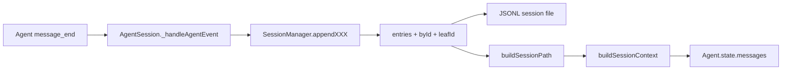
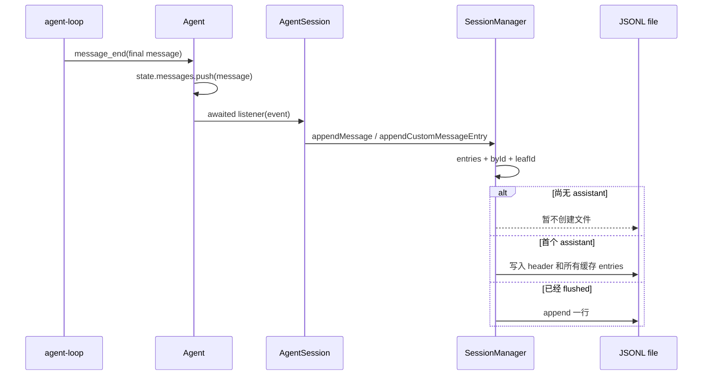

# 专题一：会话管理

## 1. 课题范围

本文回答五个代码问题：会话保存什么、如何写入、如何形成分支、如何恢复当前路径、压缩后为什么仍能保留完整历史。主要源码是 `session-manager.ts`，`AgentSession` 提供事件写入入口，`sdk.ts` 提供启动恢复入口。



## 2. 结论一：会话文件是“头记录 + 追加节点”的 JSONL

会话头记录版本、会话 id、创建时间、cwd 和可选父会话。后续节点共享 `id`、`parentId`、`timestamp`，所以文件顺序负责持久化，父指针负责表达树结构。

源码示例：

```ts
export interface SessionHeader {
	type: "session";
	version?: number; // v1 sessions don't have this
	id: string;
	timestamp: string;
	cwd: string;
	parentSession?: string;
}

export interface SessionEntryBase {
	type: string;
	id: string;
	parentId: string | null;
	timestamp: string;
}
```

证据：[会话头和节点公共字段](../packages/coding-agent/src/core/session-manager.ts#L30)。

节点不是只有聊天消息。联合类型还包含模型切换、thinking 切换、压缩、分支摘要、扩展状态、扩展消息、标签和会话名称。

源码示例：

```ts
export type SessionEntry =
	| SessionMessageEntry
	| ThinkingLevelChangeEntry
	| ModelChangeEntry
	| CompactionEntry
	| BranchSummaryEntry
	| CustomEntry
	| CustomMessageEntry
	| LabelEntry
	| SessionInfoEntry;
```

证据：[完整 SessionEntry 联合类型](../packages/coding-agent/src/core/session-manager.ts#L143)。

## 3. 结论二：会话在内存中同时维护数组、索引和当前叶子

`fileEntries` 保留物理追加顺序，`byId` 支持按父 id 回溯，`leafId` 指向当前分支末端。追加节点必须同时更新三者。

源码示例：

```ts
private _appendEntry(entry: SessionEntry): void {
	this.fileEntries.push(entry);
	this.byId.set(entry.id, entry);
	this.leafId = entry.id;
	this._persist(entry);
}
```

证据：[`_appendEntry()`](../packages/coding-agent/src/core/session-manager.ts#L1066)。

普通消息的 `parentId` 不是根据数组下标计算，而是直接取当前 `leafId`。所以先移动 leaf，再追加消息，就会自然形成新分支。

源码示例：

```ts
appendMessage(message: Message | CustomMessage | BashExecutionMessage): string {
	const entry: SessionMessageEntry = {
		type: "message",
		id: generateId(this.byId),
		parentId: this.leafId,
		timestamp: new Date().toISOString(),
		message,
	};
	this._appendEntry(entry);
	return entry.id;
}
```

证据：[`appendMessage()`](../packages/coding-agent/src/core/session-manager.ts#L1079)。

## 4. 结论三：节点 id 是碰撞检查后的短 UUID

实现最多尝试 100 次 UUID 的前 8 个字符，并使用当前索引检查碰撞；极端情况下退回完整 UUID。该 id 是树指针，不是数组下标。

源码示例：

```ts
function generateId(byId: { has(id: string): boolean }): string {
	for (let i = 0; i < 100; i++) {
		const id = randomUUID().slice(0, 8);
		if (!byId.has(id)) return id;
	}
	return randomUUID();
}
```

证据：[`generateId()`](../packages/coding-agent/src/core/session-manager.ts#L220)。

## 5. 结论四：只有出现 assistant 消息后，会话文件才首次落盘

问题：用户输入后模型可能尚未响应。如果第一条 user message 就创建文件，会留下只有输入、没有响应的会话。

代码行为：`_persist()` 先检查当前内存 entries 是否出现 assistant。没有 assistant 时不写文件；assistant 到来时，以 `wx` 新建文件并一次写入之前所有记录；之后才逐行 append。

源码示例：

```ts
const hasAssistant = this.fileEntries.some((e) => e.type === "message" && e.message.role === "assistant");
if (!hasAssistant) {
	if (this.flushed) {
		appendFileSync(this.sessionFile, `${JSON.stringify(entry)}\n`);
	} else {
		this.flushed = false;
	}
	return;
}

if (!this.flushed) {
	const fd = openSync(this.sessionFile, "wx");
	try {
		for (const e of this.fileEntries) {
			writeFileSync(fd, `${JSON.stringify(e)}\n`);
		}
	} finally {
		closeSync(fd);
	}
	this.flushed = true;
} else {
	appendFileSync(this.sessionFile, `${JSON.stringify(entry)}\n`);
}
```

证据：[`_persist()` 的延迟创建和追加分支](../packages/coding-agent/src/core/session-manager.ts#L1037)。

## 6. 结论五：当前分支通过 parentId 回溯重建

`buildSessionPath()` 接收可选 leaf：传具体 id 表示选择指定分支；省略表示使用物理数组最后一项；传 `null` 表示处于第一条 entry 之前。函数沿 `parentId` 走到根，再反转为根到叶顺序。

源码示例：

```ts
if (leafId === null) {
	return [];
}
if (leafId) {
	leaf = index.get(leafId);
}
leaf ??= entries[entries.length - 1];

const path: SessionEntry[] = [];
let current: SessionEntry | undefined = leaf;
while (current) {
	path.push(current);
	current = current.parentId ? index.get(current.parentId) : undefined;
}
path.reverse();
return path;
```

证据：[`buildSessionPath()`](../packages/coding-agent/src/core/session-manager.ts#L342)。

具体例子：

```text
u1 → a1 → u2 → a2
       └→ u3 → a3  (current leaf)
```

选择 `a3` 时只会回溯到 `u1/a1/u3/a3`，`u2/a2` 是兄弟分支，不会进入当前路径。这个结论直接来自“只沿 parentId 回溯”的循环。[证据：回溯循环](../packages/coding-agent/src/core/session-manager.ts#L360)。

## 7. 结论六：branch 不修改历史，只移动 leaf

普通分支操作只校验目标存在，然后把 `leafId` 设置为目标。下一次 `appendXXX()` 会把目标作为 parent。旧节点既不删除，也不重排。

源码示例：

```ts
branch(branchFromId: string): void {
	if (!this.byId.has(branchFromId)) {
		throw new Error(`Entry ${branchFromId} not found`);
	}
	this.leafId = branchFromId;
}
```

证据：[`branch()`](../packages/coding-agent/src/core/session-manager.ts#L1382)。

`branchWithSummary()` 的差异是：它先保存原 leaf 为 `fromId`，再移动 leaf，并立刻在新分支追加 `branch_summary`。因此摘要成为新分支的第一个 context-visible 节点。

源码示例：

```ts
const fromId = this.leafId ?? "root";
this.leafId = branchFromId;
const entry: BranchSummaryEntry = {
	type: "branch_summary",
	id: generateId(this.byId),
	parentId: branchFromId,
	timestamp: new Date().toISOString(),
	fromId,
	summary,
	details,
	usage,
	fromHook,
};
this._appendEntry(entry);
```

证据：[`branchWithSummary()`](../packages/coding-agent/src/core/session-manager.ts#L1403)。

## 8. 结论七：完整历史和当前模型上下文是两个集合

`getEntries()` 返回所有非 header entries；`buildContextEntries()` 则先选择当前 leaf path，再应用最新 compaction 边界。调用者要看完整树时用前者，要构造模型上下文时用后者。

源码示例：

```ts
getEntries(): SessionEntry[] {
	return this.fileEntries.filter((e): e is SessionEntry => e.type !== "session");
}

buildContextEntries(): SessionEntry[] {
	return buildContextEntries(this.getEntries(), this.leafId, this.byId);
}
```

证据：[`getEntries()` 与 `buildContextEntries()`](../packages/coding-agent/src/core/session-manager.ts#L1294)。

最新 compaction 的重建规则是：先放 compaction summary；再放压缩节点之前、从 `firstKeptEntryId` 开始的旧后缀；最后放压缩节点之后的新 entries。

源码示例：

```ts
const contextEntries: SessionEntry[] = [compaction];
let foundFirstKept = false;
for (let i = 0; i < compactionIdx; i++) {
	const entry = path[i];
	if (entry.id === compaction.firstKeptEntryId) {
		foundFirstKept = true;
	}
	if (foundFirstKept) {
		contextEntries.push(entry);
	}
}
contextEntries.push(...path.slice(compactionIdx + 1));
```

证据：[`buildContextEntries()` 的保留段拼接](../packages/coding-agent/src/core/session-manager.ts#L449)。

## 9. 结论八：不同 entry 对模型上下文的贡献不同

普通 message 原样进入；custom message、branch summary、compaction summary 被转换为专用 AgentMessage；thinking/model/label/session_info/custom 状态不产生消息。

源码示例：

```ts
export function sessionEntryToContextMessages(entry: SessionEntry): AgentMessage[] {
	if (entry.type === "message") {
		// ...content 兼容处理...
		return [message];
	}
	if (entry.type === "custom_message") {
		return [createCustomMessage(/* ... */)];
	}
	if (entry.type === "branch_summary" && entry.summary) {
		return [createBranchSummaryMessage(entry.summary, entry.fromId, entry.timestamp)];
	}
	if (entry.type === "compaction") {
		return [createCompactionSummaryMessage(entry.summary, entry.tokensBefore, entry.timestamp)];
	}
	return [];
}
```

证据：[`sessionEntryToContextMessages()`](../packages/coding-agent/src/core/session-manager.ts#L391)。

`CustomEntry` 和 `CustomMessageEntry` 的差异由类型注释明确规定：前者只供扩展恢复状态，不参与 LLM context；后者用于向 context 注入内容。

源码示例：

```ts
/**
 * Does NOT participate in LLM context (ignored by buildSessionContext).
 * For injecting content into context, see CustomMessageEntry.
 */
export interface CustomEntry<T = unknown> extends SessionEntryBase {
	type: "custom";
	customType: string;
	data?: T;
}
```

证据：[`CustomEntry` 的上下文约束](../packages/coding-agent/src/core/session-manager.ts#L94)。

## 10. 结论九：model 和 thinking 从完整当前路径恢复

模型消息上下文可以被压缩，但 model/thinking 的恢复不是从压缩后的 messages 推断。`getSessionContextSettings()` 扫描完整 path：thinking change 更新 thinking；model change 更新 model；assistant 消息也会更新最后使用的 provider/model。

源码示例：

```ts
for (const entry of path) {
	if (entry.type === "thinking_level_change") {
		thinkingLevel = entry.thinkingLevel;
	} else if (entry.type === "model_change") {
		model = { provider: entry.provider, modelId: entry.modelId };
	} else if (entry.type === "message" && entry.message.role === "assistant") {
		model = { provider: entry.message.provider, modelId: entry.message.model };
	}
}
```

证据：[`getSessionContextSettings()`](../packages/coding-agent/src/core/session-manager.ts#L370)。

`buildSessionContext()` 由完整 path 解析设置，再由压缩感知 entries 生成 messages。这两个输入范围是刻意分开的。

源码示例：

```ts
const path = buildSessionPath(entries, leafId, byId);
const { thinkingLevel, model } = getSessionContextSettings(path);
const messages = buildContextEntries(entries, leafId, byId).flatMap(sessionEntryToContextMessages);
return { messages, thinkingLevel, model };
```

证据：[`buildSessionContext()`](../packages/coding-agent/src/core/session-manager.ts#L469)。

## 11. 结论十：AgentSession 通过 `message_end` 持久化最终消息

流式 partial/update 不写入 session。只有 `message_end` 到达时，custom role 写成 `CustomMessageEntry`，user/assistant/toolResult 写成普通 `SessionMessageEntry`。bashExecution、compactionSummary、branchSummary 由各自专用路径保存。

源码示例：

```ts
if (event.type === "message_end") {
	if (event.message.role === "custom") {
		this.sessionManager.appendCustomMessageEntry(
			event.message.customType,
			event.message.content,
			event.message.display,
			event.message.details,
		);
	} else if (
		event.message.role === "user" ||
		event.message.role === "assistant" ||
		event.message.role === "toolResult"
	) {
		this.sessionManager.appendMessage(event.message);
	}
}
```

证据：[`AgentSession._handleAgentEvent`](../packages/coding-agent/src/core/agent-session.ts#L672)。



## 12. 结论十一：启动时恢复的是投影后的 session context

SDK 创建 session 时先调用 `sessionManager.buildSessionContext()`。若已有消息，优先尝试恢复其中记录的模型和 thinking；创建 Agent 后，再把 context messages 设置为 Agent 当前 transcript。

源码示例：

```ts
const existingSession = sessionManager.buildSessionContext();
const hasExistingSession = existingSession.messages.length > 0;

if (!model && hasExistingSession && existingSession.model) {
	const restoredModel = modelRuntime.getModel(existingSession.model.provider, existingSession.model.modelId);
	if (restoredModel && modelRuntime.hasConfiguredAuth(restoredModel.provider)) {
		model = restoredModel;
	}
}
```

证据：[`createAgentSession()` 的恢复决策](../packages/coding-agent/src/core/sdk.ts#L191)。

源码示例：

```ts
if (hasExistingSession) {
	agent.state.messages = existingSession.messages;
	if (!hasThinkingEntry) {
		sessionManager.appendThinkingLevelChange(thinkingLevel);
	}
} else {
	if (model) {
		sessionManager.appendModelChange(model.provider, model.id);
	}
	sessionManager.appendThinkingLevelChange(thinkingLevel);
}
```

证据：[恢复旧消息或记录新会话初始设置](../packages/coding-agent/src/core/sdk.ts#L374)。

## 13. 结论十二：旧版本会话在加载时迁移

当前版本常量是 3。v1→v2 为节点补充 id/parentId，并把压缩的数组下标边界转换为 entry id；v2→v3 把旧 `hookMessage` role 改为 `custom`。迁移直接修改已解析 entries。

源码示例：

```ts
export const CURRENT_SESSION_VERSION = 3;

if (version < 2) migrateV1ToV2(entries);
if (version < 3) migrateV2ToV3(entries);
```

证据：[当前版本和迁移分派](../packages/coding-agent/src/core/session-manager.ts#L30)；[`migrateToCurrentVersion()`](../packages/coding-agent/src/core/session-manager.ts#L277)。

## 14. 本专题应记住的不变量

1. 新 entry 的 `parentId` 总是追加前的 `leafId`。证据：[`appendMessage()`](../packages/coding-agent/src/core/session-manager.ts#L1079)。
2. 分支切换只移动 leaf，不删除 entries。证据：[`branch()`](../packages/coding-agent/src/core/session-manager.ts#L1382)。
3. 当前上下文只沿一个 leaf path 构建。证据：[`buildSessionPath()`](../packages/coding-agent/src/core/session-manager.ts#L342)。
4. 压缩通过新增 entry 改变上下文投影，不改写旧消息。证据：[`appendCompaction()`](../packages/coding-agent/src/core/session-manager.ts#L1119) 与 [`buildContextEntries()`](../packages/coding-agent/src/core/session-manager.ts#L426)。
5. 只有最终 `message_end` 被持久化，流式 delta 不进入 session。证据：[`Agent.processEvents()`](../packages/agent/src/agent.ts#L544) 与 [`AgentSession._handleAgentEvent`](../packages/coding-agent/src/core/agent-session.ts#L672)。

返回：[专题索引](./CORE_TOPICS_INDEX.zh-CN.md)。
