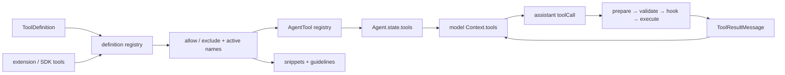
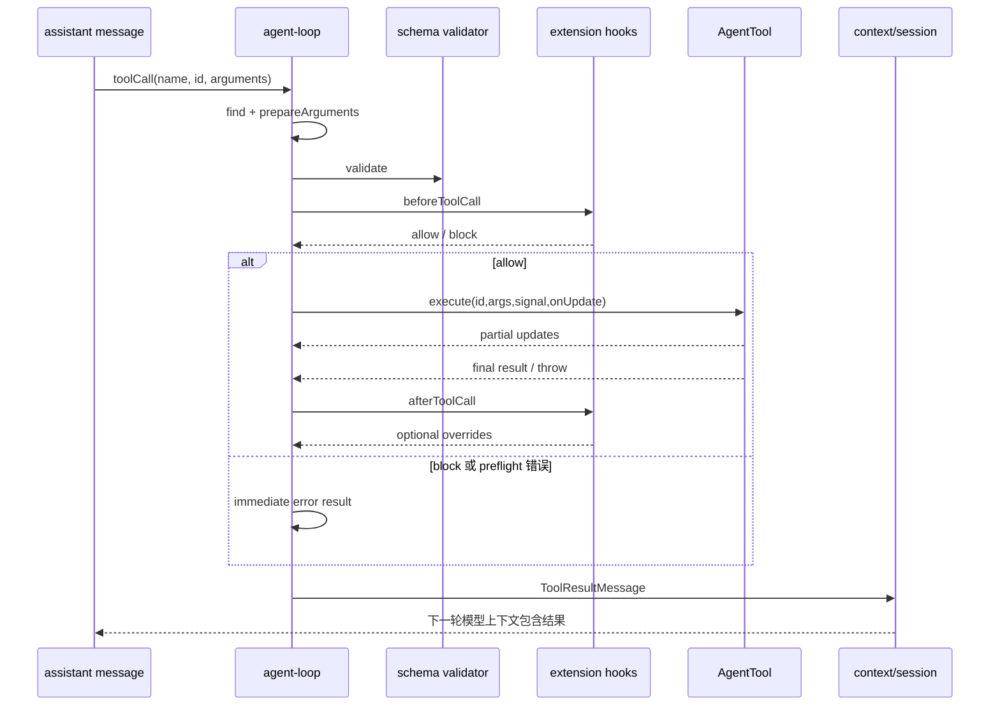

# 专题五：Tool 管理

## 1. 课题范围

本文从工具定义开始，跟踪它如何进入完整注册表、如何成为活动工具、如何暴露给模型、如何执行、如何处理扩展 hook、如何把结果回灌到下一轮上下文。最后单独说明内置 read/bash/edit/write 的代码行为。



## 2. 结论一：内置完整工具集与默认活动工具集不同

完整内置名称有 read、bash、powershell、edit、write、grep、find、ls。

源码示例：

```ts
export type ToolName = "read" | "bash" | "powershell" | "edit" | "write" | "grep" | "find" | "ls";
export const allToolNames: Set<ToolName> = new Set([
	"read",
	"bash",
	"powershell",
	"edit",
	"write",
	"grep",
	"find",
	"ls",
]);
```

证据：[内置工具名称](../packages/coding-agent/src/core/tools/index.ts#L93)。

完整 definition registry 会创建全部八个 definition。

源码示例：

```ts
return {
	read: createReadToolDefinition(cwd, options?.read),
	bash: createBashToolDefinition(cwd, options?.bash),
	powershell: createPowerShellToolDefinition(cwd, options?.powershell),
	edit: createEditToolDefinition(cwd, options?.edit),
	write: createWriteToolDefinition(cwd, options?.write),
	grep: createGrepToolDefinition(cwd, options?.grep),
	find: createFindToolDefinition(cwd, options?.find),
	ls: createLsToolDefinition(cwd, options?.ls),
};
```

证据：[`createAllToolDefinitions()`](../packages/coding-agent/src/core/tools/index.ts#L188)。

没有 override 时，普通 AgentSession 的默认活动名称只有 read、bash、edit、write。

源码示例：

```ts
const defaultActiveToolNames = this._baseToolsOverride
	? Object.keys(this._baseToolsOverride)
	: ["read", "bash", "edit", "write"];
const baseActiveToolNames = options.activeToolNames ?? defaultActiveToolNames;
```

证据：[`AgentSession._buildRuntime()`](../packages/coding-agent/src/core/agent-session.ts#L2808)。

## 3. 结论二：ToolDefinition 是协调层真源，AgentTool 是执行适配

definition 包含 name、label、description、parameters、prompt 元数据、执行模式和 execute。`wrapToolDefinition()` 把模型循环需要的字段复制到 AgentTool，并在执行时补 ExtensionContext。

源码示例：

```ts
return {
	name: definition.name,
	label: definition.label,
	description: definition.description,
	parameters: definition.parameters,
	constrainedSampling: definition.constrainedSampling,
	prepareArguments: definition.prepareArguments,
	executionMode: definition.executionMode,
	execute: (toolCallId, params, signal, onUpdate, ctx?: ExtensionContext) =>
		definition.execute(toolCallId, params, signal, onUpdate, ctx ?? (ctxFactory?.() as ExtensionContext)),
};
```

证据：[`wrapToolDefinition()`](../packages/coding-agent/src/core/tools/tool-definition-wrapper.ts#L5)。

`AgentTool` 明确规定可选参数预处理、异步 execute、partial update、terminate、addedToolNames 和每工具 executionMode。

源码示例：

```ts
export interface AgentTool<TParameters extends TSchema = TSchema, TDetails = any> extends Tool<TParameters> {
	label: string;
	prepareArguments?: (args: unknown) => Static<TParameters>;
	execute: (
		toolCallId: string,
		params: Static<TParameters>,
		signal?: AbortSignal,
		onUpdate?: AgentToolUpdateCallback<TDetails>,
	) => Promise<AgentToolResult<TDetails>>;
	replay?: "never" | "safe";
	executionMode?: ToolExecutionMode;
}
```

证据：[`AgentTool`](../packages/agent/src/types.ts#L387)。

## 4. 结论三：注册表合并顺序允许 custom tool 同名覆盖内置 tool

definition registry 先装内置 definitions，再循环 custom tools 调用 `Map.set(name, ...)`。同名 key 因此由后写入的扩展或 SDK definition 占据。

源码示例：

```ts
const definitionRegistry = new Map<string, ToolDefinitionEntry>(
	Array.from(this._baseToolDefinitions.entries())
		.filter(([name]) => isAllowedTool(name))
		.map(([name, definition]) => [
			name,
			{
				definition,
				sourceInfo: createSyntheticSourceInfo(`<builtin:${name}>`, { source: "builtin" }),
			},
		]),
);
for (const tool of allCustomTools) {
	definitionRegistry.set(tool.definition.name, {
		definition: tool.definition,
		sourceInfo: tool.sourceInfo,
	});
}
```

证据：[`_refreshToolRegistry()` 的 definition 合并](../packages/coding-agent/src/core/agent-session.ts#L2687)。

执行 registry 采用相同顺序：先创建内置 map，再 set 扩展工具。

源码示例：

```ts
const toolRegistry = new Map(wrappedBuiltInTools.map((tool) => [tool.name, tool]));
for (const tool of wrappedExtensionTools as AgentTool[]) {
	toolRegistry.set(tool.name, tool);
}
this._toolRegistry = toolRegistry;
```

证据：[执行 registry 合并](../packages/coding-agent/src/core/agent-session.ts#L2733)。

## 5. 结论四：allowlist 和 exclude 在注册表构造前统一过滤

工具必须同时满足：没有 allowlist 或名称在 allowlist 中，并且名称不在 exclude set 中。内置、扩展和 SDK custom tool 都使用这个判断。

源码示例：

```ts
const allowedToolNames = this._allowedToolNames;
const excludedToolNames = this._excludedToolNames;
const isAllowedTool = (name: string): boolean =>
	(!allowedToolNames || allowedToolNames.has(name)) && !excludedToolNames?.has(name);

const allCustomTools = [
	...registeredTools,
	...this._customTools.map(/* ... */),
].filter((tool) => isAllowedTool(tool.definition.name));
```

证据：[`_refreshToolRegistry()` 的过滤器](../packages/coding-agent/src/core/agent-session.ts#L2671)。

## 6. 结论五：活动工具是完整 registry 的子集，未知名称被忽略

`setActiveToolsByName()` 只接受 registry 中能找到的名称。它同时保存有效名称，用来重建 system prompt。

源码示例：

```ts
const tools: AgentTool[] = [];
const validToolNames: string[] = [];
for (const name of toolNames) {
	const tool = this._toolRegistry.get(name);
	if (tool) {
		tools.push(tool);
		validToolNames.push(name);
	}
}
this.agent.state.tools = tools;

this._baseSystemPrompt = this._rebuildSystemPrompt(validToolNames);
this.agent.state.systemPrompt = this._systemPromptOverride ?? this._baseSystemPrompt;
```

证据：[`setActiveToolsByName()`](../packages/coding-agent/src/core/agent-session.ts#L970)。

## 7. 结论六：工具执行器和 system prompt 元数据来自同一 definition registry

刷新 registry 时从 definitions 分别提取 `promptSnippet` 与 `promptGuidelines`，再包装 execute。活动名称变化时，`_rebuildSystemPrompt()` 只读取这些活动名称对应的元数据。

源码示例：

```ts
this._toolPromptSnippets = new Map(
	Array.from(definitionRegistry.values())
		.map(({ definition }) => {
			const snippet = this._normalizePromptSnippet(definition.promptSnippet);
			return snippet ? ([definition.name, snippet] as const) : undefined;
		})
		.filter((entry): entry is readonly [string, string] => entry !== undefined),
);
```

证据：[tool prompt 元数据索引](../packages/coding-agent/src/core/agent-session.ts#L2704)。

源码示例：

```ts
for (const name of validToolNames) {
	const snippet = this._toolPromptSnippets.get(name);
	if (snippet) {
		toolSnippets[name] = snippet;
	}

	const toolGuidelines = this._toolPromptGuidelines.get(name);
	if (toolGuidelines) {
		promptGuidelines.push(...toolGuidelines);
	}
}
```

证据：[`_rebuildSystemPrompt()`](../packages/coding-agent/src/core/agent-session.ts#L1065)。

## 8. 结论七：一次 assistant tool call 先经过 preflight

preflight 顺序是按名称查找、可选参数修正、schema 校验、`beforeToolCall`。工具不存在、任何步骤抛错、hook 阻止或 signal abort 都返回 immediate error，而不是抛出到 agent run 外。

源码示例：

```ts
const tool = currentContext.tools?.find((t) => t.name === toolCall.name);
if (!tool) {
	return {
		kind: "immediate",
		result: createErrorToolResult(`Tool ${toolCall.name} not found`),
		isError: true,
	};
}

try {
	const preparedToolCall = prepareToolCallArguments(tool, toolCall);
	const validatedArgs = validateToolArguments(tool, preparedToolCall);
	if (config.beforeToolCall) {
		const beforeResult = await config.beforeToolCall(/* ... */);
		if (beforeResult?.block) {
			const result = createErrorToolResult(beforeResult.reason || "Tool execution was blocked");
			return { kind: "immediate", result, isError: true };
		}
	}
	return { kind: "prepared", toolCall, tool, args: validatedArgs };
} catch (error) {
	return {
		kind: "immediate",
		result: createErrorToolResult(error instanceof Error ? error.message : String(error)),
		isError: true,
	};
}
```

证据：[`prepareToolCall()`](../packages/agent/src/agent-loop.ts#L622)。

## 9. 结论八：`prepareArguments` 在 schema 校验之前运行

这个 hook 用于兼容模型产生的非标准参数形态。只有返回对象与原参数不是同一个引用时，才复制 toolCall 并替换 arguments。

源码示例：

```ts
function prepareToolCallArguments(tool: AgentTool<any>, toolCall: AgentToolCall): AgentToolCall {
	if (!tool.prepareArguments) {
		return toolCall;
	}
	const preparedArguments = tool.prepareArguments(toolCall.arguments);
	if (preparedArguments === toolCall.arguments) {
		return toolCall;
	}
	return {
		...toolCall,
		arguments: preparedArguments as Record<string, any>,
	};
}
```

证据：[`prepareToolCallArguments()`](../packages/agent/src/agent-loop.ts#L608)。

edit tool 使用它兼容“edits 被模型输出成 JSON 字符串”或“单个 edit 对象”的情况，然后再交给标准 schema 校验。

源码示例：

```ts
if (typeof args.edits === "string") {
	try {
		const parsed = JSON.parse(args.edits);
		if (Array.isArray(parsed)) {
			args.edits = parsed;
		}
	} catch {
		// Leave invalid input for schema validation.
	}
}
```

证据：[`prepareEditArguments()`](../packages/coding-agent/src/core/tools/edit.ts#L103)。

## 10. 结论九：扩展 tool hooks 安装在 Agent 上，并动态读取当前 runner

`beforeToolCall` 发 `tool_call`，扩展可以 block；非 Error 异常会包装为明确错误。runner 在执行时读取，所以 reload 后无需重新安装 Agent hook。

源码示例：

```ts
this.agent.beforeToolCall = async ({ toolCall, args }) => {
	const runner = this._extensionRunner;
	if (!runner.hasHandlers("tool_call")) {
		return undefined;
	}

	try {
		return await runner.emitToolCall({
			type: "tool_call",
			toolName: toolCall.name,
			toolCallId: toolCall.id,
			input: args as Record<string, unknown>,
		});
	} catch (err) {
		if (err instanceof Error) throw err;
		throw new Error(`Extension failed, blocking execution: ${String(err)}`);
	}
};
```

证据：[`_installAgentToolHooks()` 的 before hook](../packages/coding-agent/src/core/agent-session.ts#L486)。

after hook 可以替换结果，并在 hook 后统一标准化图片内容。

源码示例：

```ts
const hookResult = runner.hasHandlers("tool_result")
	? await runner.emitToolResult({
			type: "tool_result",
			toolName: toolCall.name,
			toolCallId: toolCall.id,
			input: args as Record<string, unknown>,
			content: result.content,
			details: result.details,
			isError,
			usage: result.usage,
		})
	: undefined;

const content = hookResult?.content ?? result.content ?? [];
const normalizedContent = await normalizeToolResultImages(content, {
	autoResizeImages: this.settingsManager.getImageAutoResize(),
});
```

证据：[after hook 与图片标准化](../packages/coding-agent/src/core/agent-session.ts#L508)。

## 11. 结论十：工具抛错会被转换成普通错误结果

execute 的 throw 被捕获，内容变成 text error，`isError=true`。这样后续仍能生成 `ToolResultMessage` 给模型读取。

源码示例：

```ts
try {
	const result = await prepared.tool.execute(/* ... */);
	acceptingUpdates = false;
	await Promise.all(updateEvents);
	return { result, isError: false };
} catch (error) {
	acceptingUpdates = false;
	await Promise.all(updateEvents);
	return {
		result: createErrorToolResult(error instanceof Error ? error.message : String(error)),
		isError: true,
	};
}
```

证据：[`executePreparedToolCall()`](../packages/agent/src/agent-loop.ts#L692)。

错误结果的统一形态是一个 text block 和空 details。

源码示例：

```ts
function createErrorToolResult(message: string): AgentToolResult<any> {
	return {
		content: [{ type: "text", text: message }],
		details: {},
	};
}
```

证据：[`createErrorToolResult()`](../packages/agent/src/agent-loop.ts#L782)。

## 12. 结论十一：partial update 只在 execute 尚未结束时有效

execute 期间的 `onUpdate` 被转换为 `tool_execution_update`。结果 settle 后，`acceptingUpdates=false`，并等待已经提交的 update listener 全部完成；晚到 update 被忽略。

源码示例：

```ts
let acceptingUpdates = true;

const result = await prepared.tool.execute(
	prepared.toolCall.id,
	prepared.args as never,
	signal,
	(partialResult) => {
		if (!acceptingUpdates) return;
		updateEvents.push(
			Promise.resolve(
				emit({
					type: "tool_execution_update",
					toolCallId: prepared.toolCall.id,
					toolName: prepared.toolCall.name,
					args: prepared.toolCall.arguments,
					partialResult,
				}),
			),
		);
	},
);
acceptingUpdates = false;
await Promise.all(updateEvents);
```

证据：[`executePreparedToolCall()` 的 update 生命周期](../packages/agent/src/agent-loop.ts#L697)。

## 13. 结论十二：后置 hook 可覆盖结果，hook 自己失败也变成错误结果

after result 的 content/details/usage/terminate 按字段覆盖原结果，`isError` 单独覆盖。hook 抛错时，原工具成功结果会被替换为 hook error。

源码示例：

```ts
if (afterResult) {
	result = {
		...result,
		content: afterResult.content ?? result.content,
		details: afterResult.details ?? result.details,
		usage: afterResult.usage ?? result.usage,
		terminate: afterResult.terminate ?? result.terminate,
	};
	isError = afterResult.isError ?? isError;
}
```

证据：[`finalizeExecutedToolCall()`](../packages/agent/src/agent-loop.ts#L735)。

## 14. 结论十三：并行策略按“整批”决定

只要全局配置是 sequential，或本批任何工具声明 sequential，整批都顺序执行；否则整批进入并行路径。

源码示例：

```ts
const hasSequentialToolCall = toolCalls.some(
	(tc) => currentContext.tools?.find((t) => t.name === tc.name)?.executionMode === "sequential",
);
if (config.toolExecution === "sequential" || hasSequentialToolCall) {
	return executeToolCallsSequential(currentContext, assistantMessage, toolCalls, config, signal, emit);
}
return executeToolCallsParallel(currentContext, assistantMessage, toolCalls, config, signal, emit);
```

证据：[`executeToolCalls()`](../packages/agent/src/agent-loop.ts#L424)。

## 15. 结论十四：并行执行仍保证结果顺序等于 tool call 源顺序

并行路径先按 toolCalls 顺序做 start 和 preflight，把可执行项保存为异步函数。之后 `Promise.all` 并发调用，但返回数组保持输入位置；最后依次生成 messages。

源码示例：

```ts
const orderedFinalizedCalls = await Promise.all(
	finalizedCalls.map((entry) => (typeof entry === "function" ? entry() : Promise.resolve(entry))),
);
const messages: ToolResultMessage[] = [];
for (const finalized of orderedFinalizedCalls) {
	const toolResultMessage = createToolResultMessage(finalized);
	await emitToolResultMessage(toolResultMessage, emit);
	messages.push(toolResultMessage);
}
```

证据：[`executeToolCallsParallel()`](../packages/agent/src/agent-loop.ts#L502)。

顺序路径每完成一个工具就发 end/result，并在 signal aborted 时停止处理后续调用。

源码示例：

```ts
await emitToolExecutionEnd(finalized, emit);
const toolResultMessage = createToolResultMessage(finalized);
await emitToolResultMessage(toolResultMessage, emit);
finalizedCalls.push(finalized);
messages.push(toolResultMessage);

if (signal?.aborted) {
	break;
}
```

证据：[`executeToolCallsSequential()`](../packages/agent/src/agent-loop.ts#L446)。

## 16. 结论十五：`length` 结束的 assistant 中，所有工具调用都不执行

输出达到 token 上限时，工具参数可能只生成了一部分。代码不尝试逐个判断是否安全，而是把该 assistant 中全部 tool calls 转成错误结果。

源码示例：

```ts
const executedToolBatch =
	message.stopReason === "length"
		? await failToolCallsFromTruncatedMessage(toolCalls, emit)
		: await executeToolCalls(currentContext, message, config, signal, emit);
```

证据：[`runLoop()` 的 length 保护](../packages/agent/src/agent-loop.ts#L232)。

源码示例：

```ts
result: createErrorToolResult(
	`Tool call "${toolCall.name}" was not executed: the response hit the output token limit, so its arguments may be truncated. Re-issue the tool call with complete arguments.`,
),
isError: true,
```

证据：[`failToolCallsFromTruncatedMessage()`](../packages/agent/src/agent-loop.ts#L389)。

## 17. 结论十六：只有整批工具都要求 terminate，loop 才停止工具轮次

单个工具返回 `terminate=true` 不足以停止包含其他普通结果的批次；实现要求非空批次中每个最终结果都为 true。

源码示例：

```ts
function shouldTerminateToolBatch(finalizedCalls: FinalizedToolCallOutcome[]): boolean {
	return finalizedCalls.length > 0 && finalizedCalls.every((finalized) => finalized.result.terminate === true);
}
```

证据：[`shouldTerminateToolBatch()`](../packages/agent/src/agent-loop.ts#L604)。

## 18. 结论十七：最终结果作为标准消息回灌并持久化

最终 result 被转成 role=toolResult，保留 tool call id、tool name、details、usage、addedToolNames 和 isError；缺失 content 被归一为空数组。

源码示例：

```ts
return {
	role: "toolResult",
	toolCallId: finalized.toolCall.id,
	toolName: finalized.toolCall.name,
	content: finalized.result.content ?? [],
	details: finalized.result.details,
	usage: finalized.result.usage,
	...(finalized.result.addedToolNames?.length ? { addedToolNames: finalized.result.addedToolNames } : {}),
	isError: finalized.isError,
	timestamp: Date.now(),
};
```

证据：[`createToolResultMessage()`](../packages/agent/src/agent-loop.ts#L799)。

然后以普通 `message_start/message_end` 发出，所以 Agent transcript 和 SessionManager 都使用统一消息链。

源码示例：

```ts
await emit({ type: "message_start", message: toolResultMessage });
await emit({ type: "message_end", message: toolResultMessage });
```

证据：[`emitToolResultMessage()`](../packages/agent/src/agent-loop.ts#L815)；[SessionManager 持久化入口](../packages/coding-agent/src/core/agent-session.ts#L672)。

## 19. 结论十八：read 对文本返回头部截断和下一 offset

read 把输入 offset 从 1-based 转成数组的 0-based；用户 limit 优先选择范围，再统一执行行数/字节截断。发生截断时，输出明确给出下一 offset。

源码示例：

```ts
const startLine = offset ? Math.max(0, offset - 1) : 0;
const startLineDisplay = startLine + 1;

if (limit !== undefined) {
	const endLine = Math.min(startLine + limit, allLines.length);
	selectedContent = allLines.slice(startLine, endLine).join("\n");
	userLimitedLines = endLine - startLine;
} else {
	selectedContent = allLines.slice(startLine).join("\n");
}

const truncation = truncateHead(selectedContent);
```

证据：[`read.execute()` 的范围和截断](../packages/coding-agent/src/core/tools/read.ts#L127)。

源码示例：

```ts
const endLineDisplay = startLineDisplay + truncation.outputLines - 1;
const nextOffset = endLineDisplay + 1;
outputText = truncation.content;
outputText += `\n\n[Showing lines ${startLineDisplay}-${endLineDisplay} of ${totalFileLines}. Use offset=${nextOffset} to continue.]`;
```

证据：[read 截断续读提示](../packages/coding-agent/src/core/tools/read.ts#L157)。

## 20. 结论十九：bash 流式聚合输出，最终保留尾部并保存完整截断输出

bash 使用 `OutputAccumulator`，数据到达时 append 并节流发送 partial update。最终 snapshot 若截断，会把 fullOutputPath 放入 details 和文本提示。

源码示例：

```ts
const output = new OutputAccumulator({ tempFilePrefix: config.tempFilePrefix });

const handleData = (data: Buffer) => {
	if (!acceptingOutput) return;
	output.append(data);
	scheduleOutputUpdate();
};
```

证据：[`createShellToolDefinition()` 的输出累计](../packages/coding-agent/src/core/tools/bash.ts#L254)。

源码示例：

```ts
if (truncation.truncated) {
	details = { truncation, fullOutputPath: snapshot.fullOutputPath };
	const startLine = truncation.totalLines - truncation.outputLines + 1;
	const endLine = truncation.totalLines;
	// append a Full output path notice
}
```

证据：[bash 截断结果格式化](../packages/coding-agent/src/core/tools/bash.ts#L316)。

非零 exit code、abort 和 timeout 都通过 throw 进入 agent-loop 的统一错误 tool result 路径。

源码示例：

```ts
if (err instanceof Error && err.message === "aborted") {
	throw new Error(appendStatus(text, "Command aborted"));
}
if (err instanceof Error && err.message.startsWith("timeout:")) {
	const timeoutSecs = err.message.split(":")[1];
	throw new Error(appendStatus(text, `Command timed out after ${timeoutSecs} seconds`));
}

if (exitCode !== 0 && exitCode !== null) {
	throw new Error(appendStatus(outputText, `Command exited with code ${exitCode}`));
}
```

证据：[bash 错误转换](../packages/coding-agent/src/core/tools/bash.ts#L338)。

## 21. 结论二十：edit/write 对同一真实文件串行化

queue key 优先取 `realpath`；目标不存在时退回 resolved absolute path。同一路径的操作链式等待，不同 key 可以并行。

源码示例：

```ts
async function getMutationQueueKey(filePath: string): Promise<string> {
	const resolvedPath = resolve(filePath);
	try {
		return await realpath(resolvedPath);
	} catch (error) {
		if (isMissingPathError(error)) {
			return resolvedPath;
		}
		throw error;
	}
}
```

证据：[`getMutationQueueKey()`](../packages/coding-agent/src/core/tools/file-mutation-queue.ts#L16)。

源码示例：

```ts
const { key, currentQueue, chainedQueue, releaseNext } = await registration;
await currentQueue;
try {
	return await fn();
} finally {
	releaseNext();
	if (fileMutationQueues.get(key) === chainedQueue) {
		fileMutationQueues.delete(key);
	}
}
```

证据：[`withFileMutationQueue()`](../packages/coding-agent/src/core/tools/file-mutation-queue.ts#L32)。

write 在持有 queue 时创建父目录并覆盖内容；每个 await 后检查 abort，避免提前释放 queue 而底层写操作随后又完成。

源码示例：

```ts
return withFileMutationQueue(absolutePath, async () => {
	const throwIfAborted = (): void => {
		if (signal?.aborted) throw new Error("Operation aborted");
	};

	throwIfAborted();
	await ops.mkdir(dir);
	throwIfAborted();
	await ops.writeFile(absolutePath, content);
	throwIfAborted();

	return {
		content: [{ type: "text", text: `Successfully wrote to ${path}` }],
		details: undefined,
	};
});
```

证据：[`write.execute()`](../packages/coding-agent/src/core/tools/write.ts#L58)。

edit 在同一 queue 内读取原文、去 BOM、归一换行、基于原文应用全部 edits、恢复原换行并写回。

源码示例：

```ts
const buffer = await ops.readFile(absolutePath);
const rawContent = buffer.toString("utf-8");
const { bom, text: content } = splitBom(rawContent);
const originalEnding = detectLineEnding(content);
const normalizedContent = normalizeToLF(content);
const { baseContent, newContent } = applyEditsToNormalizedContent(normalizedContent, edits, path);

const finalContent = bom + restoreLineEndings(newContent, originalEnding);
await ops.writeFile(absolutePath, finalContent);
```

证据：[`edit.execute()`](../packages/coding-agent/src/core/tools/edit.ts#L159)。

## 22. 工具调用顺序图



## 23. 本专题应记住的不变量

1. 完整 registry 大于默认活动集合。证据：[`createAllToolDefinitions()`](../packages/coding-agent/src/core/tools/index.ts#L188) 和 [`_buildRuntime()`](../packages/coding-agent/src/core/agent-session.ts#L2808)。
2. 活动工具执行器和 system prompt 元数据来自同一 definition registry。证据：[`_refreshToolRegistry()`](../packages/coding-agent/src/core/agent-session.ts#L2671)。
3. 参数修正发生在 schema 校验之前。证据：[`prepareToolCall()`](../packages/agent/src/agent-loop.ts#L622)。
4. 工具错误被转换为 toolResult，让模型能够读取并修正。证据：[`executePreparedToolCall()`](../packages/agent/src/agent-loop.ts#L692)。
5. 并行完成顺序不会改变 toolResult 的源顺序。证据：[`executeToolCallsParallel()`](../packages/agent/src/agent-loop.ts#L502)。
6. 只有批次全部 terminate，agent 才停止工具轮次。证据：[`shouldTerminateToolBatch()`](../packages/agent/src/agent-loop.ts#L604)。
7. edit/write 的同文件 queue 是顶层 tool 并行策略之外的第二层保护。证据：[`withFileMutationQueue()`](../packages/coding-agent/src/core/tools/file-mutation-queue.ts#L32)。

返回：[专题索引](./CORE_TOPICS_INDEX.zh-CN.md)。
