# Pi 核心代码学习指南

本文只解释当前仓库默认 `pi` CLI 的真实调用链。所有结论均来自仓库源码；未使用网络资料。行号对应本文生成时的源码快照。

## 1. 阅读范围与边界

默认 CLI 从 `main()` 进入，创建 `SessionManager`、cwd 绑定的服务、`AgentSessionRuntime` 和 `AgentSession`，最后按 RPC、交互或打印模式运行。因此本文以 `packages/coding-agent/src/main.ts`、`packages/coding-agent/src/core/`、`packages/agent/src/` 为主线。[证据：`main()` 的运行时创建与模式分派](../packages/coding-agent/src/main.ts#L562) [证据：运行时装配](../packages/coding-agent/src/main.ts#L713)

`packages/agent/src/harness/` 是另一套可复用 harness 实现，但默认 CLI 主入口没有导入它；默认路径导入的是 `core/agent-session-runtime.ts` 和 `core/agent-session-services.ts`。本文不把实验性或替代实现混入主流程。[证据：主入口导入](../packages/coding-agent/src/main.ts#L37) [证据：主入口创建默认运行时](../packages/coding-agent/src/main.ts#L841)

本文关注以下五块：

| 主题 | 主要入口 | 代码职责证据 |
| --- | --- | --- |
| 会话管理 | `SessionManager` | JSONL 追加、树索引、分支和上下文重建，见 [`session-manager.ts`](../packages/coding-agent/src/core/session-manager.ts#L864) |
| 上下文管理 | `AgentSession`、`Agent` | 运行时状态、消息转换、每轮快照和事件持久化，见 [`agent-session.ts`](../packages/coding-agent/src/core/agent-session.ts#L310) 与 [`agent.ts`](../packages/agent/src/agent.ts#L173) |
| 上下文压缩 | `prepareCompaction()`、`compact()` | 计算切点、生成摘要、保留最近后缀，见 [`compaction.ts`](../packages/coding-agent/src/core/compaction/compaction.ts#L760) 与 [`compaction.ts`](../packages/coding-agent/src/core/compaction/compaction.ts#L868) |
| Prompt 管理 | `DefaultResourceLoader`、`buildSystemPrompt()` | 加载上下文文件、系统提示、skills 和模板并组装最终 prompt，见 [`resource-loader.ts`](../packages/coding-agent/src/core/resource-loader.ts#L196) 与 [`system-prompt.ts`](../packages/coding-agent/src/core/system-prompt.ts#L35) |
| Tool 管理 | `_buildRuntime()`、`runLoop()` | 建立工具注册表、选择活动工具、执行工具并回灌结果，见 [`agent-session.ts`](../packages/coding-agent/src/core/agent-session.ts#L2764) 与 [`agent-loop.ts`](../packages/agent/src/agent-loop.ts#L162) |

## 2. 总体调用链

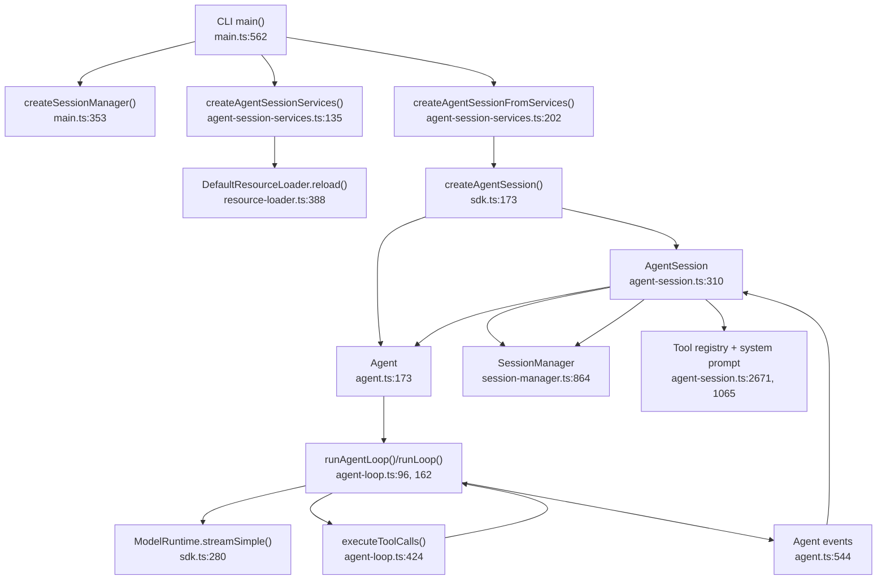

上图中 CLI 只负责解析和装配；`AgentSession` 负责把资源、会话、扩展、重试和压缩接到 `Agent` 上；`Agent` 负责一次运行的状态和队列；`runLoop()` 负责模型—工具循环。[证据：`main()` 头部说明](../packages/coding-agent/src/main.ts#L1) [证据：`AgentSession` 头部说明](../packages/coding-agent/src/core/agent-session.ts#L1) [证据：`Agent` 类说明](../packages/agent/src/agent.ts#L166) [证据：`runLoop()`](../packages/agent/src/agent-loop.ts#L153)

## 3. 一次用户请求的顺序图

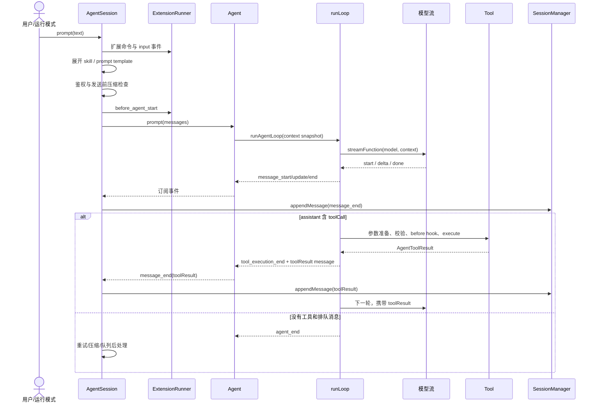

`AgentSession.prompt()` 的实际顺序是：先处理扩展命令，再发 `input` 事件，再展开 skill 和文件模板；若正在流式生成则进入 steer/follow-up 队列，否则检查模型与认证、执行发送前压缩检查、发 `before_agent_start`，最后调用 `_runAgentPrompt()`。[证据：prompt 预处理](../packages/coding-agent/src/core/agent-session.ts#L1159) [证据：构造消息与 `before_agent_start`](../packages/coding-agent/src/core/agent-session.ts#L1256) [证据：进入 Agent](../packages/coding-agent/src/core/agent-session.ts#L1315)

`Agent.prompt()` 复制当前 system prompt、messages 和 tools 形成快照，然后调用低层循环；运行期间通过事件更新 `streamingMessage`、最终消息和待执行工具集合。[证据：prompt 与快照](../packages/agent/src/agent.ts#L350) [证据：`createContextSnapshot()`](../packages/agent/src/agent.ts#L437) [证据：事件归约](../packages/agent/src/agent.ts#L544)

`AgentSession` 订阅这些事件，并在每个 `message_end` 把 user、assistant、toolResult 追加到 `SessionManager`；因此 UI 事件、运行时状态和磁盘会话由同一条事件链串起来。[证据：订阅安装](../packages/coding-agent/src/core/agent-session.ts#L400) [证据：事件持久化](../packages/coding-agent/src/core/agent-session.ts#L643)

## 4. 会话管理

### 4.1 数据结构：追加式 JSONL 树

会话文件第一条是 `SessionHeader`，后续 `SessionEntry` 都包含 `id`、`parentId` 和 `timestamp`。消息、模型切换、thinking 切换、压缩摘要、分支摘要、标签等都是树上的节点。[证据：会话头与公共节点字段](../packages/coding-agent/src/core/session-manager.ts#L30) [证据：`SessionEntry` 联合类型](../packages/coding-agent/src/core/session-manager.ts#L143)

`SessionManager` 维护 `byId` 索引和当前 `leafId`。追加节点时，新节点的 `parentId` 指向当前叶子，随后叶子前移；分支操作只把叶子移到旧节点，并不修改或删除已有节点。[证据：内部索引字段](../packages/coding-agent/src/core/session-manager.ts#L864) [证据：`_appendEntry()`](../packages/coding-agent/src/core/session-manager.ts#L1066) [证据：`branch()`](../packages/coding-agent/src/core/session-manager.ts#L1382)

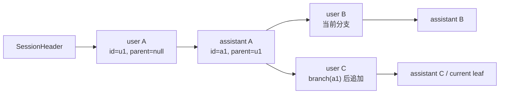

上图中的分叉来自 `branch(branchFromId)` 先移动 `leafId`，再由下一次 `_appendEntry()` 创建新子节点；`getBranch()` 只沿当前节点的 `parentId` 回溯到根。[证据：`branch()`](../packages/coding-agent/src/core/session-manager.ts#L1382) [证据：`getBranch()`](../packages/coding-agent/src/core/session-manager.ts#L1282)

### 4.2 为什么“磁盘历史”不等于“模型上下文”

`buildSessionPath()` 先从选定叶子沿 `parentId` 回溯，所以兄弟分支不会进入当前上下文；`buildContextEntries()` 再处理最新压缩节点，只保留压缩摘要、`firstKeptEntryId` 开始的旧路径后缀，以及压缩节点之后的新条目。[证据：`buildSessionPath()`](../packages/coding-agent/src/core/session-manager.ts#L334) [证据：`buildContextEntries()`](../packages/coding-agent/src/core/session-manager.ts#L426)

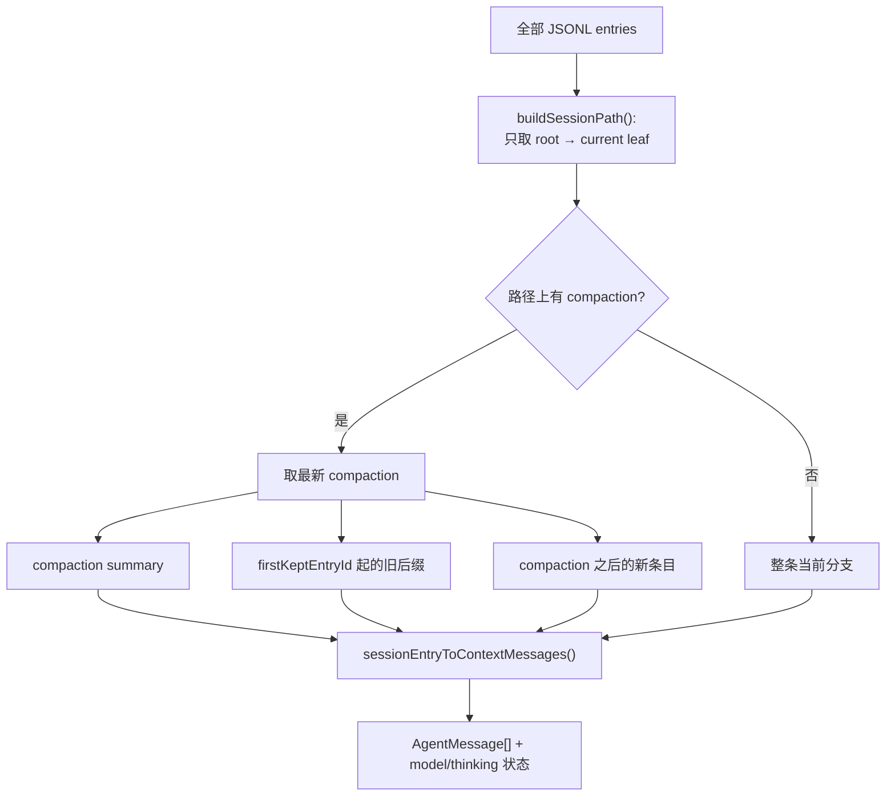

条目投影规则也不同：普通 message 原样进入；`custom_message` 变成 custom message；branch summary 和 compaction summary 变成专用摘要消息；模型切换、标签和普通 custom 状态条目不产生上下文消息。[证据：`sessionEntryToContextMessages()`](../packages/coding-agent/src/core/session-manager.ts#L391)

持久化采用延迟创建：只有出现 assistant 消息后才首次把内存中的所有条目写入文件，之后每个节点直接追加。这避免只输入用户消息但没有模型响应时产生不完整会话文件。[证据：`_persist()`](../packages/coding-agent/src/core/session-manager.ts#L1037)

## 5. 上下文管理

### 5.1 三类上下文

代码中需要区分三种状态：

| 状态 | 内容 | 证据 |
| --- | --- | --- |
| 会话历史 | 完整 JSONL 树和当前叶子 | [`SessionManager` 字段](../packages/coding-agent/src/core/session-manager.ts#L864) |
| Agent 运行时状态 | system prompt、当前模型、thinking、活动工具、当前消息数组、流式状态 | [`AgentState`](../packages/agent/src/types.ts#L334) |
| 单次模型请求上下文 | system prompt、转换后的 messages、当前 tools | [`AgentContext`](../packages/agent/src/types.ts#L415) 与 [`streamAssistantResponse()`](../packages/agent/src/agent-loop.ts#L289) |

新会话会先记录初始 model/thinking；恢复旧会话时，`createAgentSession()` 从 `SessionManager.buildSessionContext()` 恢复消息、模型和 thinking，再创建 `AgentSession`。[证据：恢复决策](../packages/coding-agent/src/core/sdk.ts#L193) [证据：恢复消息或记录初始设置](../packages/coding-agent/src/core/sdk.ts#L374)

每次模型调用前，`streamAssistantResponse()` 先运行可选的 `transformContext`，再调用 `convertToLlm`，最后构造 `{ systemPrompt, messages, tools }`。应用自定义消息不会直接泄漏给 provider，而是在这个边界转成标准 user/assistant/toolResult 消息或被过滤。[证据：模型调用边界](../packages/agent/src/agent-loop.ts#L289) [证据：coding-agent 消息转换](../packages/coding-agent/src/core/messages.ts#L148)

工具执行可能改变活动工具、模型、thinking 或触发自动压缩。`AgentSession` 安装的 `prepareNextTurnWithContext` 在下一次模型请求前刷新 context、system prompt、tools、model 和 thinking；这保证同一次 agent run 的后续轮次能看到这些变化。[证据：下一轮刷新](../packages/coding-agent/src/core/agent-session.ts#L542)

steering 与 follow-up 是两个独立 FIFO 队列。steering 在一次 assistant 轮次和工具执行完成后注入；follow-up 只在 agent 原本要停止时注入。队列模式可以一次取全部或只取最早一条。[证据：队列实现](../packages/agent/src/agent.ts#L125) [证据：内外两层循环的取队列位置](../packages/agent/src/agent-loop.ts#L167)

## 6. 上下文压缩

### 6.1 触发条件

默认设置启用压缩，保留 `16384` token 作为余量，并尽量保留最近 `20000` token。阈值条件是 `contextTokens > contextWindow - reserveTokens`。[证据：默认设置](../packages/coding-agent/src/core/compaction/compaction.ts#L126) [证据：`shouldCompact()`](../packages/coding-agent/src/core/compaction/compaction.ts#L235)

token 统计优先使用最近有效 assistant response 的 provider usage；它之后新增的消息再用估算补上。若没有有效 usage，则全部消息按内容估算；文本估算采用字符数除以 4，图片按固定字符量折算。[证据：`estimateContextTokens()`](../packages/coding-agent/src/core/compaction/compaction.ts#L198) [证据：`estimateTokens()`](../packages/coding-agent/src/core/compaction/compaction.ts#L262)

自动压缩有三种代码路径：上下文溢出后压缩并最多重试一次、成功响应已越界时只压缩不重试、普通阈值越界时压缩不重试。[证据：`_checkCompaction()` 的三种情况](../packages/coding-agent/src/core/agent-session.ts#L2111)

### 6.2 压缩流程图

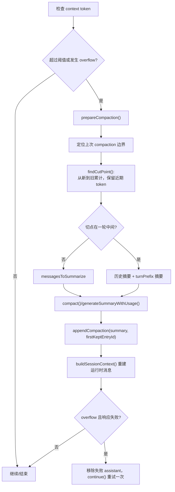

`findCutPoint()` 只允许在 user-like 或 assistant 消息处切割，绝不直接从 toolResult 开始；这样保留下来的工具结果仍有对应的 tool call。[证据：合法切点判断](../packages/coding-agent/src/core/compaction/compaction.ts#L308) [证据：`findCutPoint()`](../packages/coding-agent/src/core/compaction/compaction.ts#L403)

`prepareCompaction()` 先找到上次压缩摘要及其保留边界，再把切点之前的历史放入 `messagesToSummarize`；若切到一轮中间，则把该轮前缀单独放入 `turnPrefixMessages`。这个函数只返回计划，不修改会话。[证据：`prepareCompaction()`](../packages/coding-agent/src/core/compaction/compaction.ts#L750)

摘要请求会先把自定义消息转换为标准 LLM 消息，再序列化为带 `[User]`、`[Assistant]`、`[Tool result]` 标记的文本，使用专门的 summarization system prompt，而不是让模型直接续写原对话。[证据：摘要 prompt 构造](../packages/coding-agent/src/core/compaction/compaction.ts#L656) [证据：序列化](../packages/coding-agent/src/core/compaction/utils.ts#L109) [证据：摘要 system prompt](../packages/coding-agent/src/core/compaction/utils.ts#L156)

工具结果在摘要输入中最多保留 2000 字符，同时摘要末尾单独记录已读和已修改文件；这减少大型命令输出对摘要预算的占用，又保留后续继续编码所需的文件线索。[证据：工具结果截断](../packages/coding-agent/src/core/compaction/utils.ts#L89) [证据：文件操作收集与格式化](../packages/coding-agent/src/core/compaction/utils.ts#L20)

### 6.3 压缩顺序图

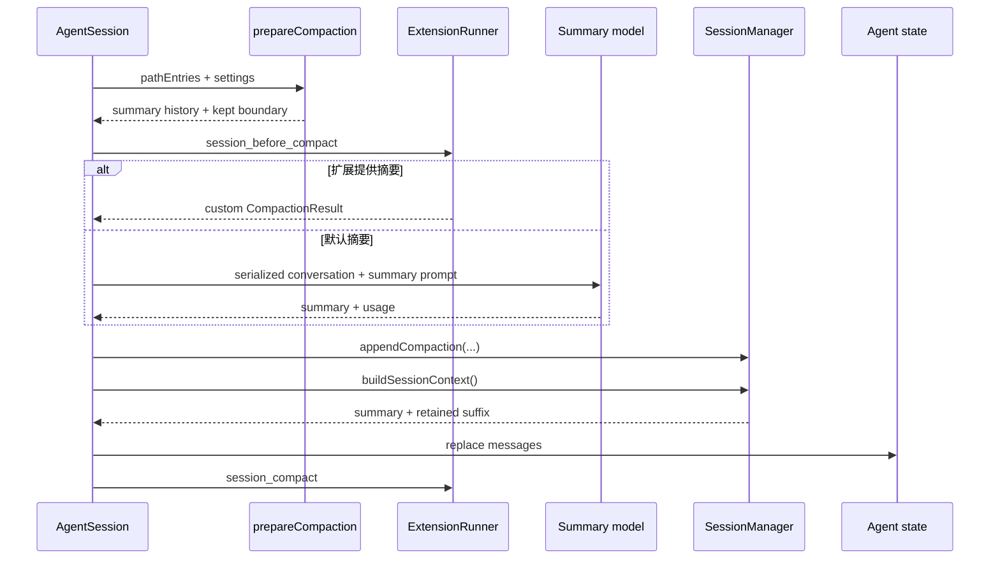

手动压缩和自动压缩都允许 `session_before_compact` 扩展取消或替换摘要；成功后都追加 compaction entry 并用 `buildSessionContext()` 替换 Agent 当前消息。两条路径的实现分别位于 `compact()` 和 `_runAutoCompaction()`。[证据：手动压缩](../packages/coding-agent/src/core/agent-session.ts#L1946) [证据：自动压缩](../packages/coding-agent/src/core/agent-session.ts#L2248)

## 7. Prompt 管理

### 7.1 资源加载

项目上下文文件的候选顺序是 `AGENTS.override.md`、`AGENTS.md`、大小写变体和 `CLAUDE.md`；每个目录只取第一个命中的文件。加载顺序先是全局 agentDir，再从文件系统根到 cwd 的祖先目录，最终形成由宽到窄的项目指令序列。[证据：候选与单目录加载](../packages/coding-agent/src/core/resource-loader.ts#L71) [证据：祖先遍历与顺序](../packages/coding-agent/src/core/resource-loader.ts#L119)

系统 prompt 可来自 CLI/显式配置，也可自动发现：受信任项目优先使用 `.pi/SYSTEM.md`，否则使用全局 `SYSTEM.md`；追加 prompt 对应 `.pi/APPEND_SYSTEM.md` 或全局文件。[证据：系统 prompt 来源解析](../packages/coding-agent/src/core/resource-loader.ts#L526) [证据：自动发现](../packages/coding-agent/src/core/resource-loader.ts#L1023)

文件模板来自全局 prompts、项目 `.pi/prompts` 和显式路径；Markdown frontmatter 可提供 description 与 argument hint。调用 `/name args` 时，模板支持 `$1`、`$@`、默认值和切片形式的参数替换。[证据：模板加载](../packages/coding-agent/src/core/prompt-templates.ts#L104) [证据：模板来源](../packages/coding-agent/src/core/prompt-templates.ts#L194) [证据：参数替换](../packages/coding-agent/src/core/prompt-templates.ts#L70)

### 7.2 最终 system prompt 的组装顺序

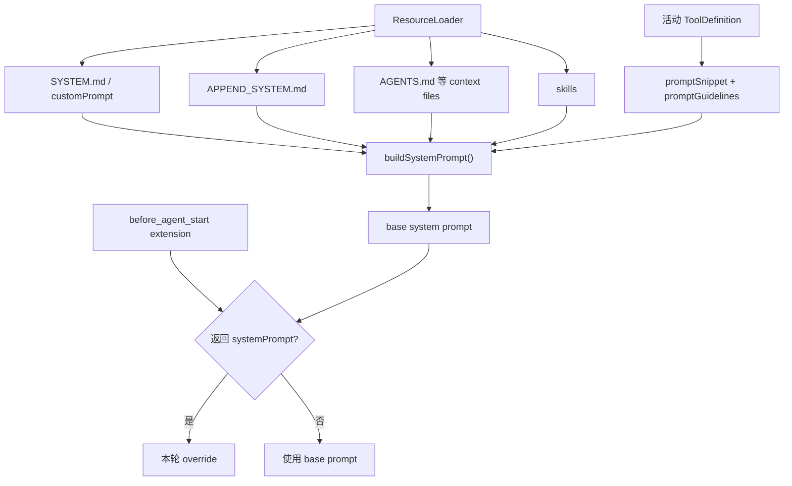

自定义 system prompt 只替换内置基础文本，追加 prompt、项目上下文、可读取的 skills 和 cwd 仍会加在后面。没有自定义 prompt 时，只有带 `promptSnippet` 的活动工具才显示在 Available tools，活动工具的 guidelines 也被去重后加入。[证据：`buildSystemPrompt()` 自定义分支](../packages/coding-agent/src/core/system-prompt.ts#L35) [证据：默认分支的工具和 guidelines](../packages/coding-agent/src/core/system-prompt.ts#L84)

`AgentSession._rebuildSystemPrompt()` 只从当前活动工具提取 snippet/guidelines，再合并 ResourceLoader 提供的 system prompt、append prompt、skills 和 context files。工具集合变化时会重新构建基础 prompt。[证据：`_rebuildSystemPrompt()`](../packages/coding-agent/src/core/agent-session.ts#L1065) [证据：切换活动工具后重建](../packages/coding-agent/src/core/agent-session.ts#L970)

`before_agent_start` 可以为单轮替换 system prompt；`prepareNextTurnWithContext` 会在同一 agent run 的下一轮继续使用该 override，运行结束后 `_runAgentPrompt()` 清除 override。[证据：单轮 override](../packages/coding-agent/src/core/agent-session.ts#L1276) [证据：下一轮延续](../packages/coding-agent/src/core/agent-session.ts#L561) [证据：运行结束清理](../packages/coding-agent/src/core/agent-session.ts#L1105)

## 8. Tool 管理与执行

### 8.1 从定义到活动工具

内置完整注册表包含 `read`、`bash`、`powershell`、`edit`、`write`、`grep`、`find`、`ls`；普通 coding session 默认活动工具是 `read`、`bash`、`edit`、`write`。注册表比活动集合大，因此工具可以被配置、扩展和按名称启停。[证据：工具名与完整 definitions](../packages/coding-agent/src/core/tools/index.ts#L92) [证据：SDK 默认活动工具](../packages/coding-agent/src/core/sdk.ts#L256)

`_buildRuntime()` 创建全部内置 `ToolDefinition` 和 `ExtensionRunner`；`_refreshToolRegistry()` 合并内置、扩展和 SDK 工具，应用 allowlist/denylist，包装成 `AgentTool`，再选择活动集合。工具的执行器和 prompt 元数据来自同一个 definition registry。[证据：`_buildRuntime()`](../packages/coding-agent/src/core/agent-session.ts#L2764) [证据：`_refreshToolRegistry()`](../packages/coding-agent/src/core/agent-session.ts#L2671) [证据：definition 到 AgentTool 的包装](../packages/coding-agent/src/core/tools/tool-definition-wrapper.ts#L5)

工具协议由 schema、描述和执行函数组成；`AgentTool` 额外支持参数兼容预处理、流式 update 和每工具的执行模式覆盖。[证据：基础 `Tool`](../packages/ai/src/types.ts#L517) [证据：`AgentTool`](../packages/agent/src/types.ts#L387)

### 8.2 工具调用顺序图

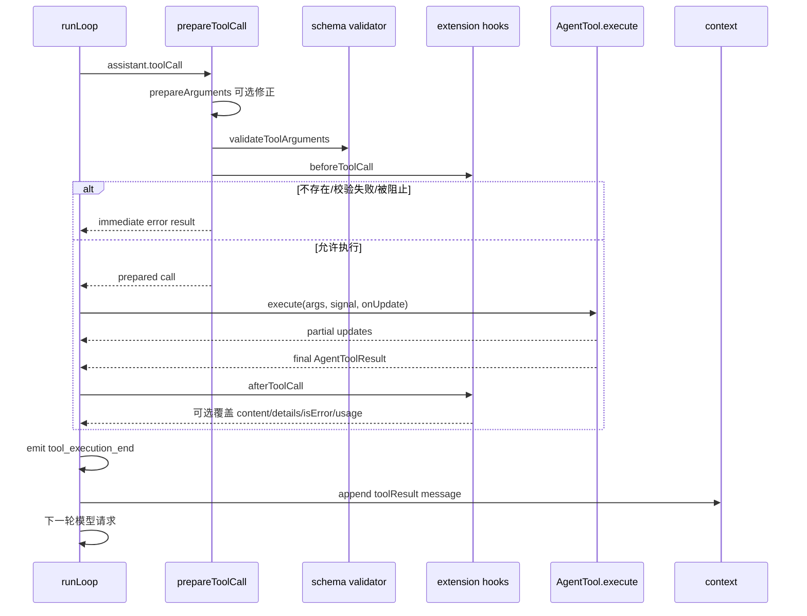

执行前先按名称查找工具、运行可选 `prepareArguments`、做 schema 校验，再调用 `beforeToolCall`；工具不存在、校验失败、被扩展阻止或收到 abort 时都会生成错误 tool result，而不是让模型循环直接崩溃。[证据：`prepareToolCall()`](../packages/agent/src/agent-loop.ts#L622)

如果全局配置要求顺序执行，或该批次任何工具声明 `executionMode: "sequential"`，整批按顺序运行；否则先按源顺序完成 preflight，再并发执行，最后按 assistant 中的原始顺序生成 toolResult 消息。[证据：模式选择](../packages/agent/src/agent-loop.ts#L424) [证据：并发执行与结果排序](../packages/agent/src/agent-loop.ts#L502)

工具的 partial result 通过 `tool_execution_update` 发给 UI；最终结果还会经过 `afterToolCall`，允许扩展替换输出或错误状态。之后结果被转换成标准 `ToolResultMessage`，追加到 context，下一轮模型调用即可读取。[证据：执行和 update](../packages/agent/src/agent-loop.ts#L692) [证据：after hook 与结果消息](../packages/agent/src/agent-loop.ts#L735)

文件型工具还有各自的约束：read 对文本做行数/字节截断并给出下一 offset；bash 保留尾部输出并把完整截断结果写入临时文件；edit 要求在原文件上唯一、互不重叠的精确替换；write 自动创建父目录后覆盖文件。[证据：read](../packages/coding-agent/src/core/tools/read.ts#L64) [证据：bash](../packages/coding-agent/src/core/tools/bash.ts#L222) [证据：edit](../packages/coding-agent/src/core/tools/edit.ts#L143) [证据：write](../packages/coding-agent/src/core/tools/write.ts#L44)

edit/write 对同一真实路径使用共享 mutation queue 串行化，不同文件仍可并发，避免同一批并行工具互相覆盖读取—写入窗口。[证据：`withFileMutationQueue()`](../packages/coding-agent/src/core/tools/file-mutation-queue.ts#L27)

## 9. 分层职责与状态所有权

理解这套代码最重要的前提，是不要把 `AgentSession`、`Agent` 和 `runLoop()` 当成同一个层次。它们持有的状态和负责的生命周期不同。

| 层次 | 持有或管理的内容 | 不负责的内容 | 直接证据 |
| --- | --- | --- | --- |
| CLI/SDK 装配层 | cwd、配置、资源加载器、模型运行时、会话管理器和初始工具集合 | 不执行模型—工具循环 | [`createAgentSession()`](../packages/coding-agent/src/core/sdk.ts#L173) |
| `AgentSession` 协调层 | 会话持久化、扩展、Prompt 资源、认证、重试、压缩、活动工具注册表 | 不直接解析模型流事件 | [构造器中的装配](../packages/coding-agent/src/core/agent-session.ts#L384) |
| `Agent` 状态层 | 当前 transcript、system prompt、model、thinking、活动工具、流式状态和两个消息队列 | 不知道 JSONL 会话格式和项目资源目录 | [`AgentState`](../packages/agent/src/types.ts#L334) 与 [`Agent`](../packages/agent/src/agent.ts#L173) |
| `runLoop()` 执行层 | 单次 run 内的模型调用、工具调用和消息注入顺序 | 不直接写文件，不负责选择资源 | [`runLoop()`](../packages/agent/src/agent-loop.ts#L162) |
| `ModelRuntime`/provider 边界 | 将模型、标准上下文和请求选项交给具体 provider | 不保存 Agent transcript | [SDK 注入的 `streamFn`](../packages/coding-agent/src/core/sdk.ts#L314) |

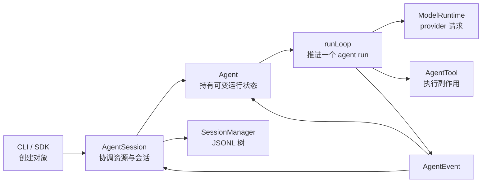

### 9.1 为什么需要两层状态对象

`Agent` 的 `messages` 是当前可供继续运行的 transcript；它可以在压缩后被整个替换。`SessionManager` 的 entries 是追加式历史，压缩不会删除旧节点。`AgentSession` 正是在两者之间同步：普通 `message_end` 追加到 session，压缩完成后又从 session 重建一份新的 Agent messages。[证据：事件写入 session](../packages/coding-agent/src/core/agent-session.ts#L672) [证据：压缩后替换 messages](../packages/coding-agent/src/core/agent-session.ts#L2356)

因此，同一个时刻可能同时存在：磁盘中的完整历史、当前分支的 entry path、压缩后的 Agent transcript、发送给 provider 的标准消息。这不是四份相同数组，而是逐层投影得到的四种表示。[证据：分支路径](../packages/coding-agent/src/core/session-manager.ts#L342) [证据：压缩感知的 entries](../packages/coding-agent/src/core/session-manager.ts#L426) [证据：entry 到 AgentMessage](../packages/coding-agent/src/core/session-manager.ts#L391) [证据：AgentMessage 到 provider Message](../packages/coding-agent/src/core/messages.ts#L148)

### 9.2 单次运行使用快照，而不是直接共享数组

进入低层循环前，`Agent.createContextSnapshot()` 对 `messages` 和 `tools` 做浅复制。这样 `runLoop()` 可以维护自己的 `currentContext`；外层状态仍通过事件归约更新。若工具或压缩改变了下一轮配置，`prepareNextTurnWithContext` 再显式返回新快照，而不是依赖某个数组被隐式修改。[证据：快照复制](../packages/agent/src/agent.ts#L437) [证据：事件归约](../packages/agent/src/agent.ts#L544) [证据：下一轮快照刷新](../packages/coding-agent/src/core/agent-session.ts#L561)

## 10. Agent 循环与事件状态机

### 10.1 `prompt()` 与 `continue()` 的入口差异

`runAgentLoop()` 接收新的 prompt messages，把它们同时加入 `newMessages` 和当前 context，并为每条 prompt 发出 `message_start`、`message_end`。`runAgentLoopContinue()` 不增加新 prompt，只从已有 context 继续；空 context 或最后一条是 assistant 都会拒绝继续。[证据：新 prompt 入口](../packages/agent/src/agent-loop.ts#L96) [证据：continue 前置条件](../packages/agent/src/agent-loop.ts#L121)

`Agent.continue()` 还多一层队列兜底：如果当前 transcript 以 assistant 结束，它先尝试取 steering，再尝试取 follow-up；只有两者都为空才报错。这允许 agent 已结束后，由后处理阶段追加的队列消息重新启动一次 run。[证据：`Agent.continue()`](../packages/agent/src/agent.ts#L361) [证据：`AgentSession` 后处理循环](../packages/coding-agent/src/core/agent-session.ts#L1105)

### 10.2 内外两层循环的精确停止条件

内层循环条件是“上一轮仍有工具调用”或“存在待注入消息”。每轮顺序固定为：刷新下一轮快照、注入 pending messages、调用模型、执行工具、发 `turn_end`、取 steering。内层结束后才读取 follow-up；有 follow-up 就重新进入内层，否则发 `agent_end`。[证据：内外循环](../packages/agent/src/agent-loop.ts#L176)

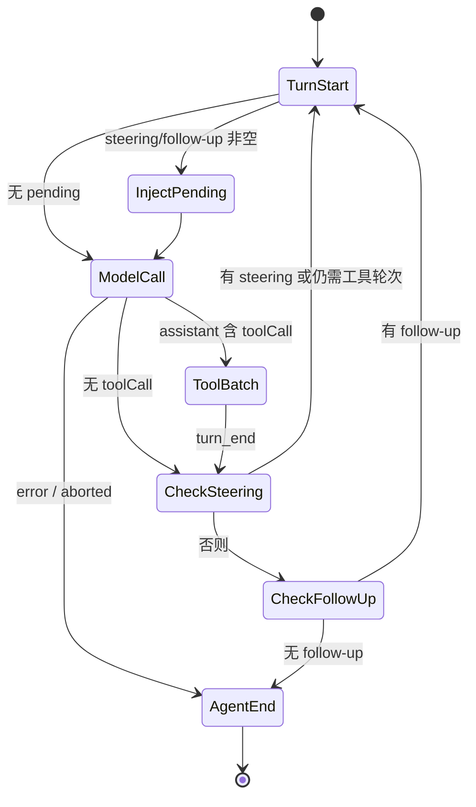

还有两个显式提前停止分支：assistant 的 `stopReason` 是 `error` 或 `aborted` 时立即结束；`shouldStopAfterTurn` 返回 true 时在完整 `turn_end` 后结束。工具批次的 `terminate` 只有在批次中每个最终结果都设置 `terminate: true` 时才成立。[证据：错误/取消结束](../packages/agent/src/agent-loop.ts#L221) [证据：turn 后停止 hook](../packages/agent/src/agent-loop.ts#L258) [证据：工具批次终止条件](../packages/agent/src/agent-loop.ts#L604)

### 10.3 模型流如何变成一条稳定消息

`streamAssistantResponse()` 在 provider 发出 `start` 时只向 context 追加一次 partial message。后续 text、thinking、tool-call delta 都替换数组最后一个元素；收到 `done`/`error` 后，再用最终 message 替换它。这样 transcript 中不会为每个 token delta 增加一条消息。[证据：partial 首次插入](../packages/agent/src/agent-loop.ts#L325) [证据：delta 原位替换](../packages/agent/src/agent-loop.ts#L334) [证据：final 替换](../packages/agent/src/agent-loop.ts#L354)

模型调用前的数据变换顺序是：`transformContext(AgentMessage[])` → `convertToLlm()` → `{systemPrompt, messages, tools}` → 解析当前 API key → `streamFunction()`。扩展的 context hook 位于第一步，coding-agent 自定义消息的标准化位于第二步。[证据：模型调用边界](../packages/agent/src/agent-loop.ts#L296) [证据：SDK 安装 context hook](../packages/coding-agent/src/core/sdk.ts#L362)

### 10.4 事件既驱动 UI，也驱动持久化

`Agent.processEvents()` 先更新内部状态，再按订阅顺序等待所有 listener。事件和状态变化如下：

| 事件 | `Agent` 内部变化 | `AgentSession` 后续动作 | 证据 |
| --- | --- | --- | --- |
| `message_start` | 设置 `streamingMessage` | 若为队列 user message，移出镜像队列 | [`Agent.processEvents()`](../packages/agent/src/agent.ts#L544)；[`_handleAgentEvent`](../packages/coding-agent/src/core/agent-session.ts#L643) |
| `message_update` | 替换 `streamingMessage` | 转发给扩展和 UI | [`Agent.processEvents()`](../packages/agent/src/agent.ts#L550)；[扩展事件转换](../packages/coding-agent/src/core/agent-session.ts#L768) |
| `message_end` | 清空 partial 并追加最终消息 | 追加普通 message 或 custom message entry | [`Agent.processEvents()`](../packages/agent/src/agent.ts#L554)；[持久化分支](../packages/coding-agent/src/core/agent-session.ts#L672) |
| `tool_execution_start/end` | 在 `pendingToolCalls` 中增删 id | 继续转发事件 | [`Agent.processEvents()`](../packages/agent/src/agent.ts#L559) |
| `turn_end` | 记录 assistant error | 刷新延迟 custom messages，递增扩展 turn index | [`Agent.processEvents()`](../packages/agent/src/agent.ts#L573)；[安全刷新点](../packages/coding-agent/src/core/agent-session.ts#L715) |
| `agent_end` | 清除 `streamingMessage` | 决定 retry、compaction 或队列 continuation | [`Agent.processEvents()`](../packages/agent/src/agent.ts#L579)；[`_handlePostAgentRun()`](../packages/coding-agent/src/core/agent-session.ts#L1120) |

`agent_end` 不是“所有工作已经 settle”的同义词。listener 是 await 的；`runWithLifecycle()` 要等事件链结束才在 `finally` 中调用 `finishRun()`，清除 `isStreaming` 和 active run。`AgentSession` 随后还会发 `agent_settled`。[证据：listener 等待](../packages/agent/src/agent.ts#L584) [证据：run 生命周期](../packages/agent/src/agent.ts#L486) [证据：session settled](../packages/coding-agent/src/core/agent-session.ts#L629)

### 10.5 未捕获异常如何进入正常事件链

低层执行若直接抛出异常，`runWithLifecycle()` 不把异常留在状态之外，而是构造一条空内容 assistant message，设置 `stopReason` 为 `error` 或 `aborted`，再依次调用 `message_start`、`message_end`、`turn_end`、`agent_end`。因此持久化层和 UI 仍收到完整的生命周期事件。[证据：异常消息规范化](../packages/agent/src/agent.ts#L511)

## 11. 会话文件、树与上下文投影

### 11.1 每类 entry 是否进入模型上下文

| Entry 类型 | 保存的数据 | 是否直接进入 context | 投影方式 | 证据 |
| --- | --- | --- | --- | --- |
| `message` | user/assistant/toolResult 等消息 | 是 | 原消息，缺失 content 时归一为空数组 | [类型](../packages/coding-agent/src/core/session-manager.ts#L53)；[投影](../packages/coding-agent/src/core/session-manager.ts#L391) |
| `thinking_level_change` | thinking 字符串 | 否 | 用于恢复 session 设置 | [类型](../packages/coding-agent/src/core/session-manager.ts#L58)；[设置恢复](../packages/coding-agent/src/core/session-manager.ts#L370) |
| `model_change` | provider、modelId | 否 | 用于恢复 session 设置 | [类型](../packages/coding-agent/src/core/session-manager.ts#L63)；[设置恢复](../packages/coding-agent/src/core/session-manager.ts#L370) |
| `compaction` | summary、保留起点、压缩前 token | 是 | 变成 `compactionSummary` | [类型](../packages/coding-agent/src/core/session-manager.ts#L69)；[投影](../packages/coding-agent/src/core/session-manager.ts#L412) |
| `branch_summary` | 被放弃分支的摘要 | 是 | 变成 `branchSummary` | [类型](../packages/coding-agent/src/core/session-manager.ts#L82)；[投影](../packages/coding-agent/src/core/session-manager.ts#L409) |
| `custom` | 扩展自己的持久状态 | 否 | 返回空消息数组 | [类型说明](../packages/coding-agent/src/core/session-manager.ts#L94)；[投影默认分支](../packages/coding-agent/src/core/session-manager.ts#L415) |
| `custom_message` | 扩展注入的消息内容和 UI 元数据 | 是 | 变成 `custom` AgentMessage | [类型说明](../packages/coding-agent/src/core/session-manager.ts#L123)；[投影](../packages/coding-agent/src/core/session-manager.ts#L404) |
| `label` / `session_info` | 书签或会话名称 | 否 | 仅影响导航和展示 | [类型](../packages/coding-agent/src/core/session-manager.ts#L110)；[投影默认分支](../packages/coding-agent/src/core/session-manager.ts#L415) |

### 11.2 追加节点的最小算法

所有 `appendXXX()` 最终都进入 `_appendEntry()`。以 message 为例，逻辑可以按源码等价地理解为：

```text
entry.id       = 生成且避免碰撞的短 id
entry.parentId = 当前 leafId
entries.push(entry)
byId.set(entry.id, entry)
leafId         = entry.id
persist(entry)
```

`generateId()` 最多尝试 100 次 8 位 UUID 前缀，再退回完整 UUID；`_appendEntry()` 同时更新数组、索引和叶子，然后才持久化。[证据：id 生成](../packages/coding-agent/src/core/session-manager.ts#L220) [证据：message entry 构造](../packages/coding-agent/src/core/session-manager.ts#L1079) [证据：统一追加](../packages/coding-agent/src/core/session-manager.ts#L1066)

首次持久化不是在第一条 user message 时发生。`_persist()` 会检查内存 entries 中是否已有 assistant；没有则保持 `flushed=false`。assistant 到来后使用 `wx` 创建文件并写入此前所有 entries；后续再逐行 append。这是源码中的实际延迟写入规则。[证据：`_persist()`](../packages/coding-agent/src/core/session-manager.ts#L1037)

### 11.3 从树恢复当前分支

`buildSessionPath()` 的输入不是“从数组中截一段”，而是一个 leaf id。函数从 `byId` 找到叶子，反复读取 `parentId`，最后 reverse。省略 leaf 时默认使用物理数组最后一项；显式传 `null` 返回空路径。[证据：`buildSessionPath()`](../packages/coding-agent/src/core/session-manager.ts#L342)

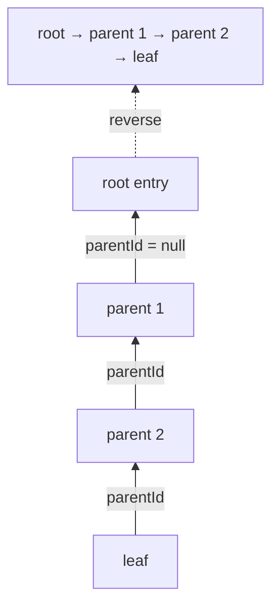

`branch(id)` 只移动 `leafId`。下一次 append 会以该 id 为 parent，原分支仍留在 entries。`branchWithSummary()` 先记住原 leaf 为 `fromId`，移动 leaf，再追加一个带摘要的新节点；`createBranchedSession()` 则把选中路径复制成另一份 session 文件，属于不同操作。[证据：`branch()`](../packages/coding-agent/src/core/session-manager.ts#L1382) [证据：`branchWithSummary()`](../packages/coding-agent/src/core/session-manager.ts#L1403) [证据：`createBranchedSession()`](../packages/coding-agent/src/core/session-manager.ts#L1435)

### 11.4 压缩后的上下文重建示例

假设当前分支路径为：

```text
u1 → a1 → u2 → a2 → u3 → a3 → compact(c1, firstKept=u3) → u4 → a4
```

`buildContextEntries()` 找到最新 `c1` 后，结果顺序是：`c1`、压缩节点之前从 `u3` 开始的后缀 `u3/a3`、压缩节点之后的 `u4/a4`。`u1/a1/u2/a2` 仍在 JSONL 中，但不进入当前 Agent messages。[证据：最新压缩节点扫描](../packages/coding-agent/src/core/session-manager.ts#L431) [证据：保留段拼接](../packages/coding-agent/src/core/session-manager.ts#L449)

随后 `buildSessionContext()` 独立完成两件事：沿完整当前 path 解析最后生效的 model/thinking；把压缩感知的 entries 投影为 messages。因此压缩旧消息不会顺带丢失模型和 thinking 的恢复信息。[证据：设置解析](../packages/coding-agent/src/core/session-manager.ts#L370) [证据：最终上下文组装](../packages/coding-agent/src/core/session-manager.ts#L469)

## 12. Prompt 的四种不同含义

源码中的 “prompt” 至少指四类不同对象。把它们混在一起，会误判优先级和作用范围。

| 名称 | 形态 | 进入模型的位置 | 生命周期 | 证据 |
| --- | --- | --- | --- | --- |
| system prompt | 单个字符串 | `Context.systemPrompt` | 基础版本可跨轮复用，扩展可单次覆盖 | [`buildSystemPrompt()`](../packages/coding-agent/src/core/system-prompt.ts#L35)；[单轮覆盖](../packages/coding-agent/src/core/agent-session.ts#L1276) |
| user prompt | user `AgentMessage` | `Context.messages` | 作为会话节点持久化 | [user message 构造](../packages/coding-agent/src/core/agent-session.ts#L1256)；[持久化](../packages/coding-agent/src/core/agent-session.ts#L672) |
| prompt template / skill command | 用户输入的预处理文本 | 展开后成为 user prompt 内容 | 仅在输入预处理阶段存在 | [模板展开](../packages/coding-agent/src/core/prompt-templates.ts#L269)；[skill 展开](../packages/coding-agent/src/core/agent-session.ts#L1353) |
| summarization prompt | 独立摘要请求的 system + user text | 单独的 summary model call | 不进入原对话 transcript | [摘要 context](../packages/coding-agent/src/core/compaction/compaction.ts#L642)；[摘要调用](../packages/coding-agent/src/core/compaction/compaction.ts#L656) |

### 12.1 用户输入的精确处理优先级

`AgentSession.prompt()` 的分支顺序具有语义：

1. 若是 `/...`，先尝试扩展命令；命中后直接执行并返回，不发送模型请求。[证据](../packages/coding-agent/src/core/agent-session.ts#L1164)
2. 压缩进行中时拒绝新 prompt。[证据](../packages/coding-agent/src/core/agent-session.ts#L1176)
3. 发 `input` hook；扩展可 handled 或 transform 文本/图片。[证据](../packages/coding-agent/src/core/agent-session.ts#L1182)
4. 先展开 `/skill:name`，再展开普通 `/template`。[证据](../packages/coding-agent/src/core/agent-session.ts#L1202)
5. 若 Agent 正在运行，根据 `streamingBehavior` 进入 steer 或 follow-up；未指定则报错。[证据](../packages/coding-agent/src/core/agent-session.ts#L1209)
6. 非流式路径先刷新延迟 bash/custom 消息，再检查 model 和认证。[证据](../packages/coding-agent/src/core/agent-session.ts#L1225)
7. 在新 user message 尚未发送前，对上一条 assistant 执行压缩检查。[证据](../packages/coding-agent/src/core/agent-session.ts#L1249)
8. 构造 user message 和 pending next-turn messages，最后发 `before_agent_start`。[证据](../packages/coding-agent/src/core/agent-session.ts#L1256)
9. 应用扩展返回的 custom messages 和 system prompt override，调用 `_runAgentPrompt()`。[证据](../packages/coding-agent/src/core/agent-session.ts#L1276) [证据](../packages/coding-agent/src/core/agent-session.ts#L1315)

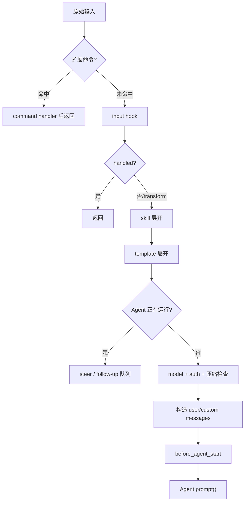

### 12.2 模板与 skill 不是同一种机制

普通模板从 Markdown 文件读取，文件名成为命令名，frontmatter 可提供 description 和 `argument-hint`；没有 description 时取正文第一条非空行并截到 60 字符。目录扫描是非递归的，只加载 `.md` 文件。[证据：模板文件解析](../packages/coding-agent/src/core/prompt-templates.ts#L104) [证据：目录扫描](../packages/coding-agent/src/core/prompt-templates.ts#L138)

模板参数解析支持单引号和双引号分组，但不实现通用 shell 解析；替换语法由单个正则显式限定为 `$N`、`$@`、`$ARGUMENTS`、默认值和参数切片，并且替换结果不会再次递归替换。[证据：参数解析](../packages/coding-agent/src/core/prompt-templates.ts#L24) [证据：替换实现](../packages/coding-agent/src/core/prompt-templates.ts#L70)

skill 命令则直接读取 skill 的文件正文，去掉 frontmatter，包装为带 `name` 和 `location` 的 `<skill>` 块，并声明相对引用的 baseDir；用户在命令后的参数原样附在 skill block 后面。[证据：`_expandSkillCommand()`](../packages/coding-agent/src/core/agent-session.ts#L1353)

### 12.3 system prompt 的确定顺序

资源加载阶段先决定基础 system prompt 来源。显式输入既可以是文件路径，也可以直接是文本；未显式提供时，受信任项目的 `.pi/SYSTEM.md` 优先于全局 `SYSTEM.md`。append prompt 使用对应的 `.pi/APPEND_SYSTEM.md`/全局文件规则。[证据：路径或文本解析](../packages/coding-agent/src/core/resource-loader.ts#L54) [证据：基础 prompt 发现](../packages/coding-agent/src/core/resource-loader.ts#L1023) [证据：append prompt 发现](../packages/coding-agent/src/core/resource-loader.ts#L1037)

`buildSystemPrompt()` 有两个清晰分支：

- 有 custom prompt：它替换内置基础说明，但仍追加 append text、project context、可读 skills 和 cwd。[证据](../packages/coding-agent/src/core/system-prompt.ts#L55)
- 无 custom prompt：构造内置说明；只有拥有 `promptSnippet` 的活动工具才出现在 Available tools，工具 guidelines 被去空白和去重，再追加固定 guidelines。[证据](../packages/coding-agent/src/core/system-prompt.ts#L87) [证据](../packages/coding-agent/src/core/system-prompt.ts#L93)

skills 只有在活动工具中存在 `read` 或 `bash` 时才加入 system prompt；生成的 skill 列表会明确写入文件位置，并指示模型使用对应工具读取文件。[证据：`skillFileReadTool`](../packages/coding-agent/src/core/system-prompt.ts#L52) [证据：skills 条件追加](../packages/coding-agent/src/core/system-prompt.ts#L167) [证据：skill 列表格式](../packages/coding-agent/src/core/skills.ts#L355)

### 12.4 项目上下文文件的覆盖含义

同一目录中只取候选列表第一个命中的文件，所以 `AGENTS.override.md` 会遮蔽该目录的 `AGENTS.md`；这不是把两者都加载后再覆盖字段。跨目录则从文件系统根到 cwd 全部收集，前面再加 agentDir 的全局文件。[证据：单目录候选顺序](../packages/coding-agent/src/core/resource-loader.ts#L71) [证据：祖先文件 `unshift`](../packages/coding-agent/src/core/resource-loader.ts#L119)

prompt template 重名时也不是“后者覆盖前者”。`dedupePrompts()` 首次见到的 name 成为 winner，后续同名项记录 collision diagnostic。[证据：模板去重](../packages/coding-agent/src/core/resource-loader.ts#L970)

### 12.5 活动工具为什么会改变 system prompt

`setActiveToolsByName()` 先从注册表解析有效工具并替换 `agent.state.tools`，随后用相同的有效名称调用 `_rebuildSystemPrompt()`。后者只收集这些活动工具的 snippet/guidelines，再合并 ResourceLoader 的 system、append、skills 和 context files。因此工具协议和告诉模型的工具说明来自同一活动集合。[证据：活动工具切换](../packages/coding-agent/src/core/agent-session.ts#L970) [证据：Prompt 重建](../packages/coding-agent/src/core/agent-session.ts#L1065)

`before_agent_start` 的 override 只覆盖当前 agent run。低层循环需要继续下一轮时，`prepareNextTurnWithContext` 会继续传递 override；`_runAgentPrompt()` 的 `finally` 在整个 run 结束后清除它。[证据：下一轮传递](../packages/coding-agent/src/core/agent-session.ts#L561) [证据：结束清理](../packages/coding-agent/src/core/agent-session.ts#L1105)

## 13. Tool 注册、执行与错误回灌

### 13.1 Definition、registry 与 active tools

`ToolDefinition` 是协调层使用的完整定义，包含执行函数以及 `promptSnippet`、`promptGuidelines` 等元数据；`wrapToolDefinition()` 把模型执行需要的字段适配为 `AgentTool`。运行时的 `AgentTool` 只保留 name、schema、参数预处理、执行模式和 execute 等字段。[证据：definition 包装](../packages/coding-agent/src/core/tools/tool-definition-wrapper.ts#L5) [证据：`AgentTool`](../packages/agent/src/types.ts#L387)

工具装配分为三步：

1. `_buildRuntime()` 创建内置 definitions 和 `ExtensionRunner`。[证据](../packages/coding-agent/src/core/agent-session.ts#L2764)
2. `_refreshToolRegistry()` 合并内置、扩展注册工具和 SDK custom tools，并应用 allow/exclude 过滤。[证据](../packages/coding-agent/src/core/agent-session.ts#L2671)
3. `setActiveToolsByName()` 从完整 registry 选择实际交给 Agent 的子集，并同步重建 system prompt。[证据](../packages/coding-agent/src/core/agent-session.ts#L970)

合并时先放内置 definition，再对 custom tools 执行同名 `Map.set()`；因此通过代码可见，同名扩展/SDK definition 会占据最终 definition registry。执行 registry 也先创建内置 map，再用扩展工具同名覆盖。[证据：definition 合并顺序](../packages/coding-agent/src/core/agent-session.ts#L2687) [证据：执行器合并顺序](../packages/coding-agent/src/core/agent-session.ts#L2733)

普通 session 的默认活动集合是 `read/bash/edit/write`，但完整内置 registry 还含 powershell、grep、find、ls。allowlist 存在时，registry 中命中的工具都会加入活动候选；初始化时也可以把全部扩展工具加入活动集合，最终名称用 `Set` 去重。[证据：默认集合](../packages/coding-agent/src/core/agent-session.ts#L2808) [证据：活动集合计算](../packages/coding-agent/src/core/agent-session.ts#L2739) [证据：完整 definitions](../packages/coding-agent/src/core/tools/index.ts#L188)

### 13.2 一次工具调用的七个阶段

| 阶段 | 行为 | 失败时的处理 | 证据 |
| --- | --- | --- | --- |
| 1. 查找 | 按 tool-call name 在当前 context tools 中查找 | 生成 immediate error | [`prepareToolCall()`](../packages/agent/src/agent-loop.ts#L622) |
| 2. 参数兼容 | 可选 `prepareArguments(raw)` | 抛错转 immediate error | [参数准备](../packages/agent/src/agent-loop.ts#L608) |
| 3. Schema 校验 | `validateToolArguments` | 生成含校验错误的 tool result | [`prepareToolCall()`](../packages/agent/src/agent-loop.ts#L622) |
| 4. 前置 hook | 调用 `beforeToolCall`，扩展可阻止 | 被阻止或 hook 抛错都转 error result | [AgentSession 安装 hook](../packages/coding-agent/src/core/agent-session.ts#L486) |
| 5. 执行 | `tool.execute(id,args,signal,onUpdate)` | throw 被捕获为 error result | [`executePreparedToolCall()`](../packages/agent/src/agent-loop.ts#L692) |
| 6. 后置 hook | 扩展可替换 content/details/usage/isError | hook 抛错会覆盖成 error result | [`finalizeExecutedToolCall()`](../packages/agent/src/agent-loop.ts#L735) |
| 7. 回灌 | 发 execution_end，创建 `ToolResultMessage`，发 message_start/end | 标准化缺失 content 为空数组 | [结果消息创建](../packages/agent/src/agent-loop.ts#L789) |

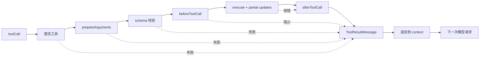

这些错误没有直接终止 agent loop，因为模型需要看到 tool result 才能修正调用。代码把“不存在、参数无效、hook 阻止、执行抛错和 abort”都编码成 `ToolResultMessage`；下一轮将它和原始 assistant tool call 一起发送。[证据：immediate error 类型](../packages/agent/src/agent-loop.ts#L578) [证据：错误结果创建](../packages/agent/src/agent-loop.ts#L782) [证据：context 追加](../packages/agent/src/agent-loop.ts#L243)

### 13.3 顺序和并行的边界

只要全局模式为 sequential，或同一 assistant message 中任何一个被调用工具声明 `executionMode: "sequential"`，整批调用都走顺序路径；不是只把那个工具单独串行化。[证据：批次模式选择](../packages/agent/src/agent-loop.ts#L424)

并行路径仍然先按源顺序做 `tool_execution_start` 和 preflight。通过 preflight 的条目被保存为异步函数，之后 `Promise.all` 并发执行；数组位置保持不变，所以 tool result 最终按原 tool-call 顺序发出，而不是按完成先后发出。[证据：并行 preflight](../packages/agent/src/agent-loop.ts#L502) [证据：并发与有序结果](../packages/agent/src/agent-loop.ts#L562)

若 assistant 因输出 token 上限以 `length` 结束，代码不会执行其中任何 tool call。即使截断后的 JSON 偶然能解析和通过 schema，也统一回灌“参数可能被截断”的错误结果，要求模型重新发出完整调用。[证据：length 分支](../packages/agent/src/agent-loop.ts#L232) [证据：批量失败实现](../packages/agent/src/agent-loop.ts#L382)

### 13.4 partial update、最终结果和持久化

工具 `onUpdate` 只在 execute promise 尚未 settle 时接收；执行完成后先等待已经提交的 update 事件，再返回最终结果。晚到 update 被 `acceptingUpdates=false` 忽略。[证据：update 生命周期](../packages/agent/src/agent-loop.ts#L692)

最终 `ToolResultMessage` 作为普通 `message_end` 同时进入 `Agent.state.messages` 和 SessionManager 的 message entry；partial update 只作为事件供 UI 使用，不进入 transcript。[证据：Agent 仅在 message_end 追加](../packages/agent/src/agent.ts#L544) [证据：Session 持久化](../packages/coding-agent/src/core/agent-session.ts#L672)

### 13.5 文件写工具的额外并发约束

顶层 tool batch 可以并行，但 edit/write 对同一文件还有第二层 mutation queue。queue key 优先使用真实路径；目标不存在时退回解析后的绝对路径。注册过程本身也串行，确保两个同时到达的新文件写操作看到同一队列。[证据：路径 key](../packages/coding-agent/src/core/tools/file-mutation-queue.ts#L16) [证据：注册和等待](../packages/coding-agent/src/core/tools/file-mutation-queue.ts#L32)

操作结束的 `finally` 会释放下一项；只有当前 map 仍指向本链尾部时才删除 key。因此同一真实文件串行，不同 key 仍可并行。[证据：释放与清理](../packages/coding-agent/src/core/tools/file-mutation-queue.ts#L51)

## 14. 上下文压缩的完整算法

### 14.1 压缩没有修改历史，只修改“读取历史的入口”

压缩结果以新的 `CompactionEntry` 追加到当前 leaf，旧 message entries 保持不变。之后 `buildContextEntries()` 识别最新 compaction，把它的 summary 与保留后缀组成新上下文。因此压缩是“新增 checkpoint + 改变投影”，不是重写或截断 JSONL 文件。[证据：追加 compaction](../packages/coding-agent/src/core/session-manager.ts#L1119) [证据：压缩感知投影](../packages/coding-agent/src/core/session-manager.ts#L426)

### 14.2 token 估算公式

有最近有效 assistant usage 时：

```text
contextTokens = providerUsageTokens + 最近 usage 之后各消息的估算 token
```

没有有效 usage 时：

```text
contextTokens = Σ estimateTokens(每条消息)
```

有效 usage 排除 `aborted`、`error` 和总量为 0 的 assistant 消息。`calculateContextTokens()` 优先使用 `usage.totalTokens`，否则相加 input、output、cacheRead、cacheWrite。[证据：有效 usage](../packages/coding-agent/src/core/compaction/compaction.ts#L150) [证据：混合估算](../packages/coding-agent/src/core/compaction/compaction.ts#L202) [证据：usage 求和](../packages/coding-agent/src/core/compaction/compaction.ts#L146)

消息估算不是 tokenizer：文本、thinking、工具名和 JSON 参数按字符计数后除以 4；图片按 4800 个字符处理。它只是在 provider usage 不覆盖新增消息时使用的保守估计。[证据：图片常量与内容计数](../packages/coding-agent/src/core/compaction/compaction.ts#L244) [证据：各消息角色估算](../packages/coding-agent/src/core/compaction/compaction.ts#L266)

触发式严格使用 `>`：

```text
contextTokens > contextWindow - reserveTokens
```

默认 `reserveTokens=16384`、`keepRecentTokens=20000`。前者决定何时触发以及摘要可用预算，后者决定切点要保留多少近期消息；它们不是同一个参数。[证据：默认设置](../packages/coding-agent/src/core/compaction/compaction.ts#L126) [证据：触发判断](../packages/coding-agent/src/core/compaction/compaction.ts#L235)

### 14.3 切点如何选择

`findCutPoint()` 先收集所有 context-visible 且允许切割的 entry。toolResult 永远不是合法切点，因为它必须跟在产生它的 assistant tool call 后面；compaction entry 也被跳过。[证据：切点消息分类](../packages/coding-agent/src/core/compaction/compaction.ts#L308) [证据：合法切点收集](../packages/coding-agent/src/core/compaction/compaction.ts#L351)

然后函数从尾部向前累计估算 token；达到 `keepRecentTokens` 后，选择当前位置或其后的最近合法切点。选择后还会向前吸收相邻、不进入 context 的 metadata entries，直到碰到 context-visible entry 或 compaction 边界。[证据：反向累计](../packages/coding-agent/src/core/compaction/compaction.ts#L415) [证据：metadata 吸收](../packages/coding-agent/src/core/compaction/compaction.ts#L441)

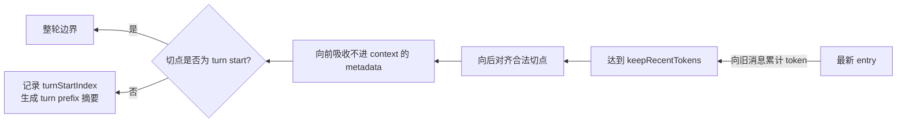

若切点落在一轮中间，`findTurnStartIndex()` 向前找到该轮 user-like 开始节点。`prepareCompaction()` 将 turn 开始之前放入 `messagesToSummarize`，将 turn 开始到切点之间放入 `turnPrefixMessages`，切点及之后直接保留。[证据：轮次起点查找](../packages/coding-agent/src/core/compaction/compaction.ts#L369) [证据：两段消息构造](../packages/coding-agent/src/core/compaction/compaction.ts#L797)

### 14.4 `prepareCompaction()` 输出字段的用途

| 字段 | 后续用途 | 证据 |
| --- | --- | --- |
| `firstKeptEntryId` | 写入 compaction entry，供下一次上下文重建定位保留后缀 | [`CompactionPreparation`](../packages/coding-agent/src/core/compaction/compaction.ts#L732)；[`appendCompaction`](../packages/coding-agent/src/core/session-manager.ts#L1119) |
| `messagesToSummarize` | 生成或更新历史摘要 | [`prepareCompaction()`](../packages/coding-agent/src/core/compaction/compaction.ts#L799) |
| `turnPrefixMessages` | 单独生成被切断轮次的前缀摘要 | [`prepareCompaction()`](../packages/coding-agent/src/core/compaction/compaction.ts#L806) |
| `previousSummary` | 选择 update prompt，把新旧摘要合并 | [上次摘要读取](../packages/coding-agent/src/core/compaction/compaction.ts#L776)；[摘要 prompt 选择](../packages/coding-agent/src/core/compaction/compaction.ts#L677) |
| `fileOps` | 摘要末尾恢复 read/modified 文件清单 | [文件操作提取](../packages/coding-agent/src/core/compaction/compaction.ts#L819)；[追加清单](../packages/coding-agent/src/core/compaction/compaction.ts#L959) |
| `tokensBefore` | 记录压缩前上下文规模 | [压缩前估算](../packages/coding-agent/src/core/compaction/compaction.ts#L786) |

如果当前路径最后一个节点本身就是 compaction、找不到有效的 first kept entry，或两类待摘要消息都为空，准备阶段返回 `undefined`，调用者不会创建空压缩。[证据：准备阶段退出条件](../packages/coding-agent/src/core/compaction/compaction.ts#L760)

### 14.5 摘要请求与原对话请求的隔离

摘要前先执行 `convertToLlm()`，再把标准消息序列化为带角色标签的文本，包进 `<conversation>`；若有 previous summary，再放进 `<previous-summary>`。最终只构造一条新的 user message，并使用固定 `SUMMARIZATION_SYSTEM_PROMPT`。[证据：摘要文本构造](../packages/coding-agent/src/core/compaction/compaction.ts#L683) [证据：独立摘要 context](../packages/coding-agent/src/core/compaction/compaction.ts#L642) [证据：序列化实现](../packages/coding-agent/src/core/compaction/utils.ts#L109)

普通历史摘要最大输出取 `min(0.8 × reserveTokens, model.maxTokens)`；turn prefix 摘要使用 `min(0.5 × reserveTokens, model.maxTokens)`。摘要调用关闭 cache retention，并为没有 sessionId 的调用生成临时路由 id。[证据：历史摘要预算](../packages/coding-agent/src/core/compaction/compaction.ts#L672) [证据：前缀摘要预算](../packages/coding-agent/src/core/compaction/compaction.ts#L993) [证据：摘要请求选项](../packages/coding-agent/src/core/compaction/compaction.ts#L579)

摘要结果只有在未以 `error`/`length` 结束、并且没有产生 tool call 时才接受。`length` 被视为不完整 checkpoint，不能写入 session。[证据：失败分类](../packages/coding-agent/src/core/compaction/compaction.ts#L545) [证据：摘要结果验证](../packages/coding-agent/src/core/compaction/compaction.ts#L715)

工具结果序列化时最多保留 2000 字符；文件操作又被单独提取并追加到最终 summary。这里同时保留“压缩文本预算”和“继续工作需要的文件状态”。这是从截断常量、文件收集和最终 summary 拼接三处代码共同得到的结论。[证据：截断常量与使用](../packages/coding-agent/src/core/compaction/utils.ts#L89) [证据：文件操作提取](../packages/coding-agent/src/core/compaction/compaction.ts#L819) [证据：文件清单追加](../packages/coding-agent/src/core/compaction/compaction.ts#L959)

### 14.6 自动压缩的三条路径

| 路径 | 条件 | 是否移除失败 assistant | 是否 `continue()` | 证据 |
| --- | --- | --- | --- | --- |
| overflow recovery | context overflow 或可恢复 length，响应未成功 stop | 是；session 历史仍保留，Agent state 暂时移除 | 最多一次 | [`_checkCompaction()`](../packages/coding-agent/src/core/agent-session.ts#L2158) |
| successful overflow | overflow 判定成立，但 assistant 已成功 stop | 否 | 否 | [成功响应分支](../packages/coding-agent/src/core/agent-session.ts#L2164) |
| threshold | usage 或估算超过阈值 | 否 | 否，除非还有队列消息 | [阈值分支](../packages/coding-agent/src/core/agent-session.ts#L2204) |

overflow retry 使用 `_overflowRecoveryAttempted` 限制为一次。第一次先从 Agent state 删除失败/截断 assistant，再压缩；压缩完成重建 context 时若该 assistant 因 kept suffix 被带回来，会再次删除，然后返回 true 让 `_runAgentPrompt()` 调用 `agent.continue()`。[证据：一次性保护](../packages/coding-agent/src/core/agent-session.ts#L2172) [证据：第一次删除](../packages/coding-agent/src/core/agent-session.ts#L2194) [证据：重建后的第二次删除](../packages/coding-agent/src/core/agent-session.ts#L2387)

阈值路径还防止使用压缩前 assistant 的旧 usage 立即再次触发压缩：如果 usage 来源时间早于最新 compaction entry，就返回 false。这说明 token 检查不仅看数值，还校验 usage 所属的时间边界。[证据：旧 assistant 边界检查](../packages/coding-agent/src/core/agent-session.ts#L2148) [证据：旧 usage 检查](../packages/coding-agent/src/core/agent-session.ts#L2215)

### 14.7 手动与自动压缩的共同点和差异

共同点：都调用 `prepareCompaction()`；都允许 `session_before_compact` 取消或提供完整替代结果；默认路径都进入 `_runDefaultCompaction()`；成功后都 append compaction、`buildSessionContext()` 并替换 Agent messages。[证据：手动路径](../packages/coding-agent/src/core/agent-session.ts#L1946) [证据：自动路径](../packages/coding-agent/src/core/agent-session.ts#L2248)

差异：手动路径把 reason 固定为 manual，失败会向调用者抛错；自动路径 reason 是 threshold/overflow，失败被转换成 compaction_end/session_compact_failed 后返回 false。自动路径还负责判断是否继续 overflow retry 或消费排队消息。[证据：手动失败处理](../packages/coding-agent/src/core/agent-session.ts#L2070) [证据：自动失败处理](../packages/coding-agent/src/core/agent-session.ts#L2403)

## 15. 已补充的源码注释

本次只补充原来说明不足、同时直接影响主流程理解的函数注释，没有改变实现：

| 文件与函数 | 新注释强调的行为 |
| --- | --- |
| [`agent-loop.ts` `runLoop()`](../packages/agent/src/agent-loop.ts#L153) | 内层模型/工具循环与外层 follow-up 循环的分工 |
| [`agent-loop.ts` `streamAssistantResponse()`](../packages/agent/src/agent-loop.ts#L279) | 唯一模型调用边界，以及 partial message 的原位替换 |
| [`agent-loop.ts` `executeToolCalls()`](../packages/agent/src/agent-loop.ts#L415) | 顺序/并行选择和结果顺序稳定性 |
| [`session-manager.ts` `buildSessionPath()`](../packages/coding-agent/src/core/session-manager.ts#L334) | 叶子选择与兄弟分支隔离 |
| [`compaction.ts` `prepareCompaction()`](../packages/coding-agent/src/core/compaction/compaction.ts#L750) | 上次摘要边界、保留后缀、切断轮次和纯准备阶段 |
| [`system-prompt.ts` `buildSystemPrompt()`](../packages/coding-agent/src/core/system-prompt.ts#L25) | custom prompt 的替换范围和后续资源拼接 |
| [`tools/index.ts` `createAllToolDefinitions()`](../packages/coding-agent/src/core/tools/index.ts#L181) | 完整注册表、活动过滤和 prompt 元数据的关系 |

## 16. 建议的源码阅读顺序

1. 先读 [`main.ts` 的 runtime 装配段](../packages/coding-agent/src/main.ts#L666)，只回答“对象如何被创建”。
2. 再读 [`sdk.ts` 的 `createAgentSession()`](../packages/coding-agent/src/core/sdk.ts#L173)，回答“模型、消息、工具和扩展如何接到 Agent”。
3. 顺着 [`AgentSession.prompt()`](../packages/coding-agent/src/core/agent-session.ts#L1159) 读到 [`Agent.prompt()`](../packages/agent/src/agent.ts#L350)，回答“用户输入如何进入低层循环”。
4. 完整读 [`runLoop()`](../packages/agent/src/agent-loop.ts#L162) 与 [`executeToolCalls()`](../packages/agent/src/agent-loop.ts#L424)，回答“模型为什么会连续多轮调用”。
5. 回到 [`SessionManager`](../packages/coding-agent/src/core/session-manager.ts#L864)，重点读 `_persist()`、`buildSessionPath()`、`buildContextEntries()`，回答“磁盘历史如何变成当前上下文”。
6. 最后读 [`prepareCompaction()`](../packages/coding-agent/src/core/compaction/compaction.ts#L760)、[`compact()`](../packages/coding-agent/src/core/compaction/compaction.ts#L868) 和 [`_checkCompaction()`](../packages/coding-agent/src/core/agent-session.ts#L2132)，回答“上下文过长后如何保留可继续工作的状态”。

以上顺序与默认 CLI 的实际依赖方向一致：装配层 → 会话协调层 → Agent 状态层 → 模型/工具循环 → 持久化与压缩。[证据：主入口装配](../packages/coding-agent/src/main.ts#L713) [证据：SDK 创建 Agent 与 AgentSession](../packages/coding-agent/src/core/sdk.ts#L270) [证据：Agent 进入低层循环](../packages/agent/src/agent.ts#L409)
